00_Overview

# Web Guide


## 📖 목차

### 🏗️ **기초 이론**

**[1. 기초 개념 및 용어 정리](#1-기초-개념-및-용어-정리)** 🎯
> 웹 애플리케이션 기본 개념 | Java EE 스택 | HTTP 프로토콜

**[2. 웹 애플리케이션 아키텍처](#2-웹-애플리케이션-아키텍처)** 🏢
> 3계층 아키텍처 | MVC 패턴 | 요청-응답 처리

**[3. 웹서버와 WAS 개념](#3-웹서버와-was-개념)** ⚙️
> 웹서버 역할 | WAS 기능 | 분리 전략

---

### 🛠️ **개발 환경 & 기본 구현**

**[4. 서블릿 컨테이너와 서블릿](#4-서블릿-컨테이너와-서블릿)** 📦
> 컨테이너 개념 | 서블릿 클래스 계층 | 실행 환경

**[5. Eclipse 개발환경 구축](#5-eclipse-개발환경-구축)** 💻
> Eclipse 설정 | Tomcat 연동 | 프로젝트 생성

**[6. Servlet 기초](#6-servlet-기초)** ⭐
> 생명주기 | HTTP 처리 | 세션/쿠키

---

### 🚀 **심화 학습 & 실무 적용**

**[7. Servlet 심화](#7-servlet-심화)** 🔥
> 필터/리스너 | 비동기 처리 | 파일 업로드

**[8. web.xml 배포 설정](#8-webxml-배포-설정)** 📋
> XML 구조 | URL 매핑 | 보안 설정

**[9. Annotation 기반 설정](#9-annotation-기반-설정)** 🏷️
> 주요 어노테이션 | XML vs 어노테이션 | 실무 예제

**[10. 향후 학습 방향](#10-향후-학습-방향)** 🎓
> 학습 로드맵 | 커리어 방향 | 포트폴리오 전략

---

### 📋 **상세 목차**

<details>
<summary><strong>📖 1. 기초 개념 및 용어 정리</strong></summary>

- **1.1** [웹 애플리케이션 기본 개념](#11-웹-애플리케이션-기본-개념)
  - 웹 애플리케이션이란? | 정적 vs 동적 웹페이지
- **1.2** [Java 웹 기술 스택](#12-java-웹-기술-스택)
  - Java EE 개념
- **1.3** [컨테이너와 컴포넌트 개념](#13-컨테이너와-컴포넌트-개념)
- **1.4** [HTTP 프로토콜 기초](#14-http-프로토콜-기초)
  - HTTP 통신 흐름 | 메서드와 상태 코드

</details>

<details>
<summary><strong>🏢 2. 웹 애플리케이션 아키텍처</strong></summary>

- **2.1** [3계층 아키텍처](#21-3계층-아키텍처-3-tier-architecture)
  - 계층간 통신 흐름
- **2.2** [MVC 패턴](#22-mvc-패턴)
  - MVC 구조 다이어그램
- **2.3** [요청-응답 처리 흐름](#23-요청-응답-처리-흐름)

</details>

<details>
<summary><strong>⚙️ 3. 웹서버와 WAS 개념</strong></summary>

- **3.1** [웹서버 개념](#31-웹서버-web-server-개념)
- **3.2** [WAS 개념](#32-was-web-application-server-개념)
- **3.3** [웹서버 vs WAS 비교](#33-웹서버-vs-was-비교)
  - 분리하는 이유와 장점

</details>

<details>
<summary><strong>📦 4. 서블릿 컨테이너와 서블릿</strong></summary>

- **4.1** [서블릿 컨테이너 개념](#41-서블릿-컨테이너-개념)
  - 컨테이너란? | 주요 기능 | 내부 구조 | 멀티스레딩 모델
- **4.2** [서블릿 기본 개념](#42-서블릿servlet-기본-개념)
  - 클래스 계층 구조 | 다른 기술과 비교 | 실행 환경

</details>

<details>
<summary><strong>💻 5. Eclipse 개발환경 구축</strong></summary>

- **5.1** [Eclipse 설치 및 기본 설정](#51-eclipse-설치-및-기본-설정)
  - 개발 환경 구성 | 설치 체크리스트
- **5.2** [서버 환경 설정](#52-서버-환경-설정)
  - Tomcat 설정 과정 | 상세 옵션
- **5.3** [Dynamic Web Project 생성](#53-dynamic-web-project-생성)
  - 프로젝트 구조 | 패키지 구조 권장사항
- **5.4** [개발 효율성 설정](#54-개발-효율성-설정)
  - Hot Deploy & 디버깅 | 유용한 단축키
- **5.5** [프로젝트 배포 및 실행](#55-프로젝트-배포-및-실행)

</details>

<details>
<summary><strong>⭐ 6. Servlet 기초</strong></summary>

- **6.1** [서블릿 생명주기](#61-서블릿-생명주기)
  - 생명주기 개요 | 다이어그램 | 단계별 특징 | 실습 예제
- **6.2** [HTTP 요청/응답 처리](#62-http-요청응답-처리)
  - 요청 처리 흐름 | 정보 추출 예제
- **6.3** [HTTP 메서드별 처리](#63-http-메서드별-처리)
  - GET 요청 패턴 | POST 요청 패턴
- **6.4** [세션과 쿠키 관리](#64-세션과-쿠키-관리)

</details>

<details>
<summary><strong>🔥 7. Servlet 심화</strong></summary>

- **7.1** [필터와 리스너](#71-필터filter와-리스너listener)
  - 필터 동작 원리 | 체인 구조 | 리스너 이벤트 처리
- **7.2** [비동기 서블릿](#72-비동기-서블릿-async-servlet)
  - 비동기 처리 흐름 | 동기 vs 비동기 비교
- **7.3** [파일 업로드/다운로드](#73-파일-업로드다운로드)
  - 업로드 처리 과정 | 보안 고려사항 | 구현 예제

</details>

<details>
<summary><strong>📋 8. web.xml 배포 설정</strong></summary>

- **8.1** [web.xml 기본 구조](#81-webxml-기본-구조)
  - 설정 계층 구조 | 기본 템플릿
- **8.2** [서블릿 및 필터 설정](#82-서블릿-및-필터-설정)
  - URL 패턴 매핑 규칙 | 필터 체인 순서
- **8.3** [보안 및 오류 처리 설정](#83-보안-및-오류-처리-설정)

</details>

<details>
<summary><strong>🏷️ 9. Annotation 기반 설정</strong></summary>

- **9.1** [주요 어노테이션](#91-주요-어노테이션)
  - 어노테이션 종류와 역할 | @WebServlet 상세 설정
- **9.2** [어노테이션 vs web.xml 비교](#92-어노테이션-vs-webxml-비교)
  - 장단점 비교 매트릭스 | 혼합 사용 전략
- **9.3** [실무 어노테이션 예제](#93-실무-어노테이션-예제)

</details>

<details>
<summary><strong>🎓 10. 향후 학습 방향</strong></summary>

- **10.1** [학습 로드맵](#101-학습-로드맵) - 단계별 학습 경로
- **10.2** [실습 프로젝트 로드맵](#102-실습-프로젝트-로드맵)
- **10.3** [커리어 발전 방향](#103-커리어-발전-방향) - 개발자 역할별 로드맵
- **10.4** [추천 학습 리소스](#104-추천-학습-리소스) - 학습 자료 매트릭스
- **10.5** [성공적인 학습 전략](#105-성공적인-학습-전략)
  - 학습 효율성 극대화 방법 | 학습 스케줄 템플릿
- **10.6** [포트폴리오 구성 전략](#106-포트폴리오-구성-전략)
  - 단계별 포트폴리오 구축 | 품질 기준
- **10.7** [면접 준비 가이드](#107-면접-준비-가이드)
  - 기술 면접 주요 주제 | 자주 나오는 질문
- **10.8** [지속적 성장을 위한 조언](#108-지속적-성장을-위한-조언)
- **10.9** [실무 투입 체크리스트](#109-실무-투입-체크리스트)
- **10.10** [다음 단계 행동 계획](#다음-단계-행동-계획)

</details>

# 1. 기초 개념 및 용어 정리

## 개요
Java 웹 개발을 시작하기 전에 반드시 이해해야 할 기본 개념과 용어들을 정리합니다.

### 1.1 웹 애플리케이션 기본 개념

#### 웹 애플리케이션이란?
웹 브라우저를 통해 인터넷상에서 실행되는 응용 프로그램으로, 서버와 클라이언트 간의 상호작용을 통해 동작합니다.

#### 정적 웹페이지 vs 동적 웹페이지

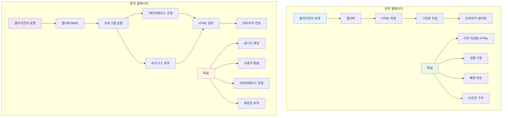
```mermaid
graph TB
    subgraph "정적 웹페이지"
        A[클라이언트 요청] --> B[웹서버]
        B --> C[HTML 파일]
        C --> D[그대로 전송]
        D --> E[브라우저 렌더링]
        
        F[특징]
        F --> F1[미리 작성된 HTML]
        F --> F2[내용 고정]
        F --> F3[빠른 로딩]
        F --> F4[단순한 구조]
    end
    
    subgraph "동적 웹페이지"
        G[클라이언트 요청] --> H[웹서버/WAS]
        H --> I[프로그램 실행]
        I --> J[데이터베이스 조회]
        I --> K[비즈니스 로직]
        J --> L[HTML 생성]
        K --> L
        L --> M[브라우저 전송]
        
        N[특징]
        N --> N1[실시간 생성]
        N --> N2[사용자 맞춤]
        N --> N3[데이터베이스 연동]
        N --> N4[복잡한 로직]
    end
    
    style A fill:#e1f5fe
    style G fill:#f3e5f5
    style F fill:#e8f5e8
    style N fill:#fff3e0
```

### 1.2 Java 웹 기술 스택

#### Java EE (Enterprise Edition) 개념
- **정의**: 엔터프라이즈 애플리케이션 개발을 위한 Java 플랫폼
- **구성**: Servlet, JSP, EJB, JPA, JMS 등의 스펙 집합
- **목적**: 대규모, 다계층, 확장 가능한 웹 애플리케이션 개발

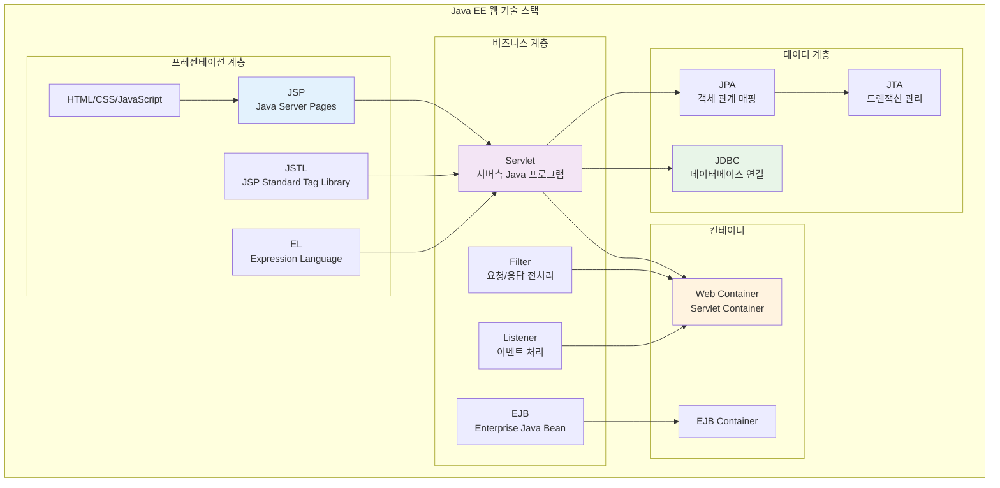
```mermaid
graph TB
    subgraph "Java EE 웹 기술 스택"
        subgraph "프레젠테이션 계층"
            A[JSP<br/>Java Server Pages]
            B[JSTL<br/>JSP Standard Tag Library]
            C[EL<br/>Expression Language]
            D[HTML/CSS/JavaScript]
        end
        
        subgraph "비즈니스 계층"
            E[Servlet<br/>서버측 Java 프로그램]
            F[Filter<br/>요청/응답 전처리]
            G[Listener<br/>이벤트 처리]
            H[EJB<br/>Enterprise Java Bean]
        end
        
        subgraph "데이터 계층"
            I[JDBC<br/>데이터베이스 연결]
            J[JPA<br/>객체 관계 매핑]
            K[JTA<br/>트랜잭션 관리]
        end
        
        subgraph "컨테이너"
            L[Web Container<br/>Servlet Container]
            M[EJB Container]
        end
    end
    
    A --> E
    B --> E
    C --> E
    D --> A
    
    E --> L
    F --> L
    G --> L
    H --> M
    
    E --> I
    E --> J
    J --> K
    
    style A fill:#e3f2fd
    style E fill:#f3e5f5
    style I fill:#e8f5e8
    style L fill:#fff3e0
```

### 1.3 컨테이너와 컴포넌트 개념

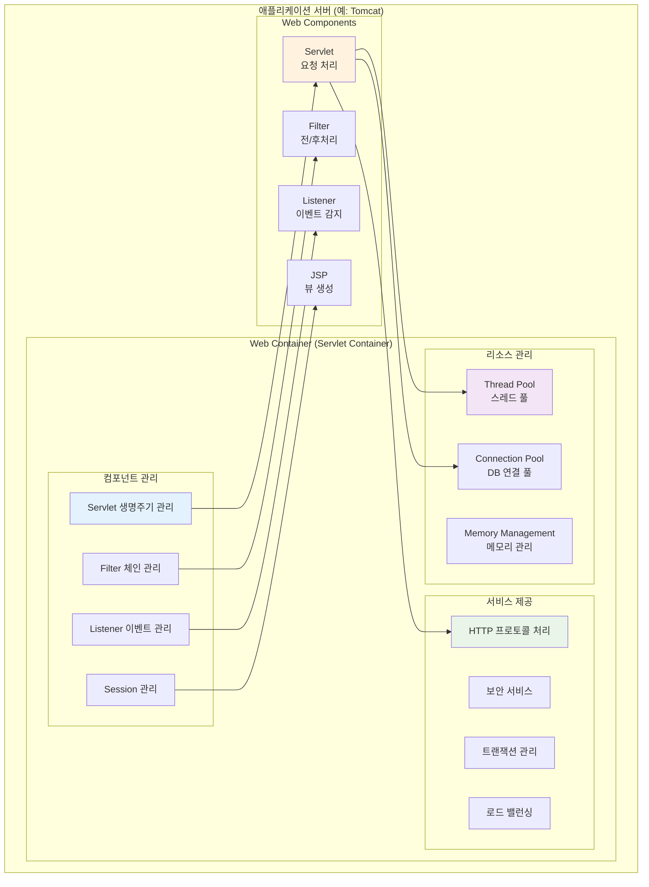
```mermaid
graph TB
    subgraph "애플리케이션 서버 (예: Tomcat)"
        subgraph "Web Container (Servlet Container)"
            subgraph "컴포넌트 관리"
                SC1[Servlet 생명주기 관리]
                SC2[Filter 체인 관리]
                SC3[Listener 이벤트 관리]
                SC4[Session 관리]
            end
            
            subgraph "리소스 관리"
                RC1[Thread Pool<br/>스레드 풀]
                RC2[Connection Pool<br/>DB 연결 풀]
                RC3[Memory Management<br/>메모리 관리]
            end
            
            subgraph "서비스 제공"
                SV1[HTTP 프로토콜 처리]
                SV2[보안 서비스]
                SV3[트랜잭션 관리]
                SV4[로드 밸런싱]
            end
        end
        
        subgraph "Web Components"
            WC1[Servlet<br/>요청 처리]
            WC2[Filter<br/>전/후처리]
            WC3[Listener<br/>이벤트 감지]
            WC4[JSP<br/>뷰 생성]
        end
    end
    
    SC1 --> WC1
    SC2 --> WC2
    SC3 --> WC3
    SC4 --> WC4
    
    WC1 --> RC1
    WC1 --> RC2
    WC1 --> SV1
    
    style SC1 fill:#e3f2fd
    style RC1 fill:#f3e5f5
    style SV1 fill:#e8f5e8
    style WC1 fill:#fff3e0
```

### 1.4 HTTP 프로토콜 기초

#### HTTP 통신 흐름

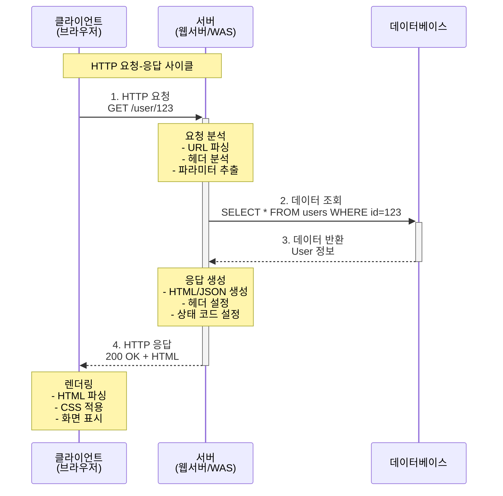
```mermaid
sequenceDiagram
    participant C as 클라이언트<br/>(브라우저)
    participant S as 서버<br/>(웹서버/WAS)
    participant D as 데이터베이스

    Note over C,S: HTTP 요청-응답 사이클
    
    C->>+S: 1. HTTP 요청<br/>GET /user/123
    Note over S: 요청 분석<br/>- URL 파싱<br/>- 헤더 분석<br/>- 파라미터 추출
    
    S->>+D: 2. 데이터 조회<br/>SELECT * FROM users WHERE id=123
    D-->>-S: 3. 데이터 반환<br/>User 정보
    
    Note over S: 응답 생성<br/>- HTML/JSON 생성<br/>- 헤더 설정<br/>- 상태 코드 설정
    
    S-->>-C: 4. HTTP 응답<br/>200 OK + HTML
    
    Note over C: 렌더링<br/>- HTML 파싱<br/>- CSS 적용<br/>- 화면 표시
```

#### 주요 HTTP 메서드와 상태 코드

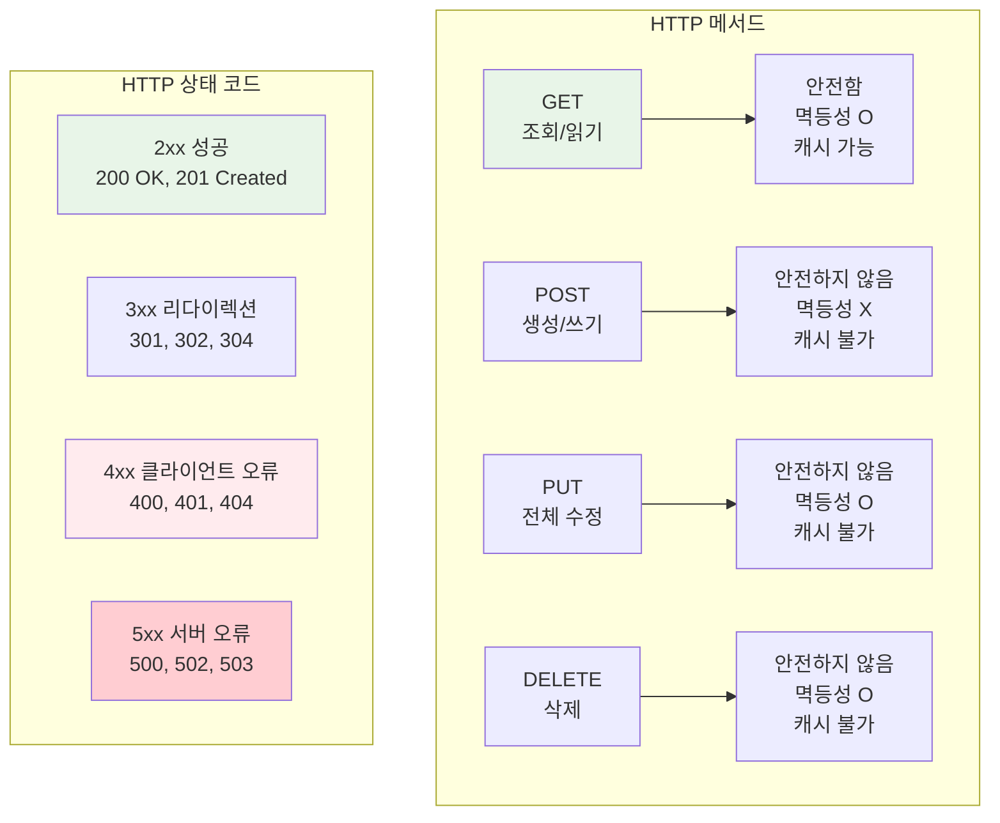
```mermaid
graph TB
    subgraph "HTTP 메서드"
        A[GET<br/>조회/읽기]
        B[POST<br/>생성/쓰기]
        C[PUT<br/>전체 수정]
        D[DELETE<br/>삭제]
        
        A --> A1[안전함<br/>멱등성 O<br/>캐시 가능]
        B --> B1[안전하지 않음<br/>멱등성 X<br/>캐시 불가]
        C --> C1[안전하지 않음<br/>멱등성 O<br/>캐시 불가]
        D --> D1[안전하지 않음<br/>멱등성 O<br/>캐시 불가]
    end
    
    subgraph "HTTP 상태 코드"
        E[2xx 성공<br/>200 OK, 201 Created]
        F[3xx 리다이렉션<br/>301, 302, 304]
        G[4xx 클라이언트 오류<br/>400, 401, 404]
        H[5xx 서버 오류<br/>500, 502, 503]
    end
    
    style A fill:#e8f5e8
    style E fill:#e8f5e8
    style G fill:#ffebee
    style H fill:#ffcdd2
```

---

# 2. 웹 애플리케이션 아키텍처

## 개요
웹 애플리케이션의 전체적인 구조와 각 계층의 역할을 이해합니다.

### 2.1 3계층 아키텍처 (3-Tier Architecture)

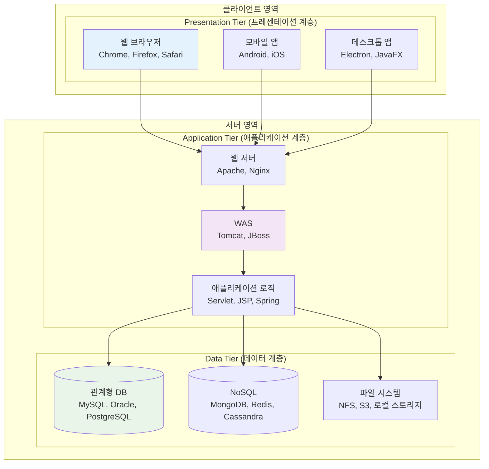
```mermaid
graph TB
    subgraph "클라이언트 영역"
        subgraph "Presentation Tier (프레젠테이션 계층)"
            A[웹 브라우저<br/>Chrome, Firefox, Safari]
            B[모바일 앱<br/>Android, iOS]
            C[데스크톱 앱<br/>Electron, JavaFX]
        end
    end
    
    subgraph "서버 영역"
        subgraph "Application Tier (애플리케이션 계층)"
            D[웹 서버<br/>Apache, Nginx]
            E[WAS<br/>Tomcat, JBoss]
            F[애플리케이션 로직<br/>Servlet, JSP, Spring]
        end
        
        subgraph "Data Tier (데이터 계층)"
            G[(관계형 DB<br/>MySQL, Oracle, PostgreSQL)]
            H[(NoSQL<br/>MongoDB, Redis, Cassandra)]
            I[파일 시스템<br/>NFS, S3, 로컬 스토리지]
        end
    end
    
    A --> D
    B --> D
    C --> D
    
    D --> E
    E --> F
    
    F --> G
    F --> H
    F --> I
    
    style A fill:#e3f2fd
    style E fill:#f3e5f5
    style G fill:#e8f5e8
```

#### 계층간 통신 흐름

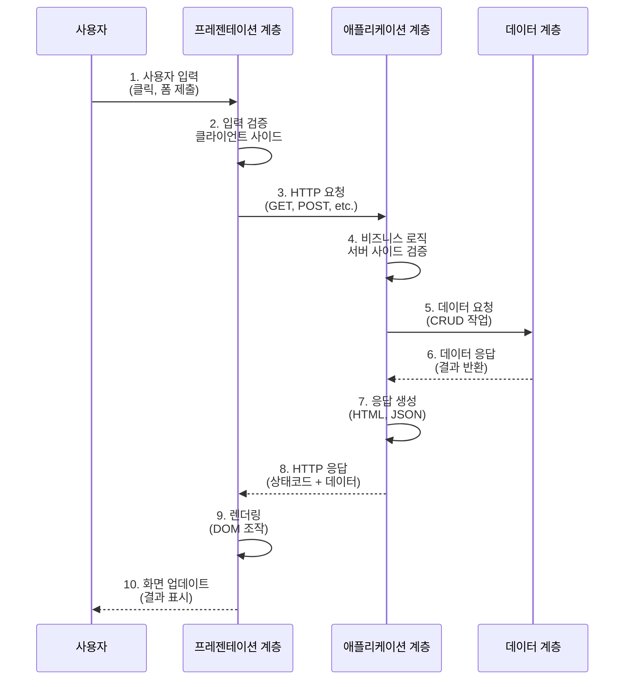
```mermaid
sequenceDiagram
    participant U as 사용자
    participant P as 프레젠테이션 계층
    participant A as 애플리케이션 계층
    participant D as 데이터 계층

    U->>P: 1. 사용자 입력<br/>(클릭, 폼 제출)
    P->>P: 2. 입력 검증<br/>클라이언트 사이드
    P->>A: 3. HTTP 요청<br/>(GET, POST, etc.)
    A->>A: 4. 비즈니스 로직<br/>서버 사이드 검증
    A->>D: 5. 데이터 요청<br/>(CRUD 작업)
    D-->>A: 6. 데이터 응답<br/>(결과 반환)
    A->>A: 7. 응답 생성<br/>(HTML, JSON)
    A-->>P: 8. HTTP 응답<br/>(상태코드 + 데이터)
    P->>P: 9. 렌더링<br/>(DOM 조작)
    P-->>U: 10. 화면 업데이트<br/>(결과 표시)
```

### 2.2 MVC 패턴

#### MVC 구조 다이어그램

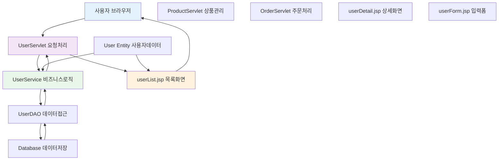
```mermaid
graph TB
    User[사용자 브라우저]
    
    C1[UserServlet 요청처리]
    C2[ProductServlet 상품관리] 
    C3[OrderServlet 주문처리]
    
    M1[User Entity 사용자데이터]
    M2[UserService 비즈니스로직]
    M3[UserDAO 데이터접근]
    M4[Database 데이터저장]
    
    V1[userList.jsp 목록화면]
    V2[userDetail.jsp 상세화면]
    V3[userForm.jsp 입력폼]
    
    User --> C1
    C1 --> M2
    M2 --> M3
    M3 --> M4
    M4 --> M3
    M3 --> M2
    M2 --> C1
    C1 --> V1
    V1 --> User
    
    M1 --> M2
    M1 --> V1
    
    style User fill:#e3f2fd
    style C1 fill:#f3e5f5
    style M2 fill:#e8f5e8
    style V1 fill:#fff3e0
```

### 2.3 요청-응답 처리 흐름

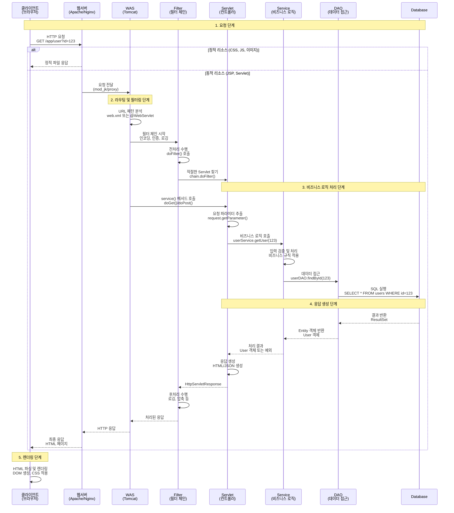
```mermaid
sequenceDiagram
    participant Client as 클라이언트<br/>(브라우저)
    participant WebServer as 웹서버<br/>(Apache/Nginx)
    participant WAS as WAS<br/>(Tomcat)
    participant Filter as Filter<br/>(필터 체인)
    participant Servlet as Servlet<br/>(컨트롤러)
    participant Service as Service<br/>(비즈니스 로직)
    participant DAO as DAO<br/>(데이터 접근)
    participant DB as Database

    Note over Client,DB: 1. 요청 단계
    Client->>WebServer: HTTP 요청<br/>GET /app/user?id=123
    
    alt 정적 리소스 (CSS, JS, 이미지)
        WebServer-->>Client: 정적 파일 응답
    else 동적 리소스 (JSP, Servlet)
        WebServer->>WAS: 요청 전달<br/>(mod_jk/proxy)
        
        Note over WAS: 2. 라우팅 및 필터링 단계
        WAS->>WAS: URL 패턴 분석<br/>web.xml 또는 @WebServlet
        WAS->>Filter: 필터 체인 시작<br/>인코딩, 인증, 로깅
        Filter->>Filter: 전처리 수행<br/>doFilter() 호출
        Filter->>Servlet: 적절한 Servlet 찾기<br/>chain.doFilter()
        
        Note over Servlet,DB: 3. 비즈니스 로직 처리 단계
        WAS->>Servlet: service() 메서드 호출<br/>doGet()/doPost()
        Servlet->>Servlet: 요청 파라미터 추출<br/>request.getParameter()
        
        Servlet->>Service: 비즈니스 로직 호출<br/>userService.getUser(123)
        Service->>Service: 입력 검증 및 처리<br/>비즈니스 규칙 적용
        Service->>DAO: 데이터 접근<br/>userDAO.findById(123)
        DAO->>DB: SQL 실행<br/>SELECT * FROM users WHERE id=123
        
        Note over DB,Servlet: 4. 응답 생성 단계
        DB-->>DAO: 결과 반환<br/>ResultSet
        DAO-->>Service: Entity 객체 반환<br/>User 객체
        Service-->>Servlet: 처리 결과<br/>User 객체 또는 예외
        
        Servlet->>Servlet: 응답 생성<br/>HTML/JSON 생성
        Servlet-->>Filter: HttpServletResponse
        Filter->>Filter: 후처리 수행<br/>로깅, 압축 등
        Filter-->>WAS: 처리된 응답
        WAS-->>WebServer: HTTP 응답
        WebServer-->>Client: 최종 응답<br/>HTML 페이지
    end
    
    Note over Client: 5. 렌더링 단계
    Client->>Client: HTML 파싱 및 렌더링<br/>DOM 생성, CSS 적용
```

---

# 3. 웹서버와 WAS 개념

## 개요
웹서버와 WAS의 차이점과 각각의 역할을 명확히 이해합니다.

### 3.1 웹서버 (Web Server) 개념

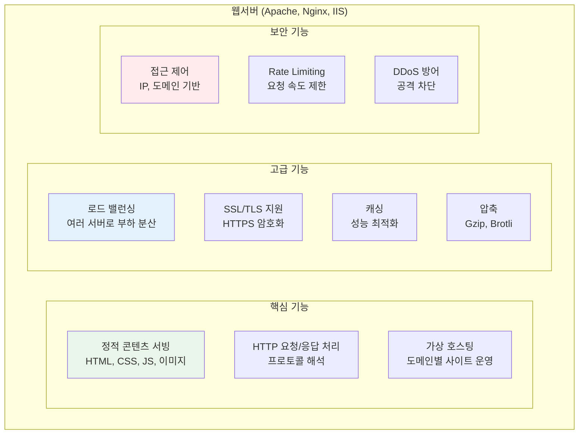
```mermaid
graph TB
    subgraph "웹서버 (Apache, Nginx, IIS)"
        subgraph "핵심 기능"
            A[정적 콘텐츠 서빙<br/>HTML, CSS, JS, 이미지]
            B[HTTP 요청/응답 처리<br/>프로토콜 해석]
            C[가상 호스팅<br/>도메인별 사이트 운영]
        end
        
        subgraph "고급 기능"
            D[로드 밸런싱<br/>여러 서버로 부하 분산]
            E[SSL/TLS 지원<br/>HTTPS 암호화]
            F[캐싱<br/>성능 최적화]
            G[압축<br/>Gzip, Brotli]
        end
        
        subgraph "보안 기능"
            H[접근 제어<br/>IP, 도메인 기반]
            I[Rate Limiting<br/>요청 속도 제한]
            J[DDoS 방어<br/>공격 차단]
        end
    end
    
    style A fill:#e8f5e8
    style D fill:#e3f2fd
    style H fill:#ffebee
```

### 3.2 WAS (Web Application Server) 개념

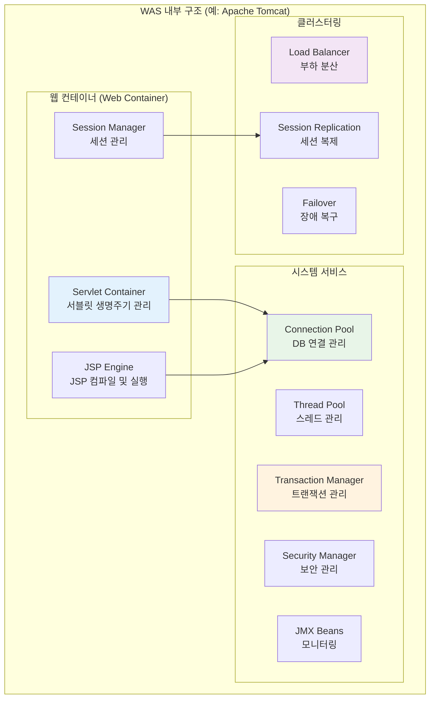
```mermaid
graph TB
    subgraph "WAS 내부 구조 (예: Apache Tomcat)"
        subgraph "웹 컨테이너 (Web Container)"
            A[Servlet Container<br/>서블릿 생명주기 관리]
            B[JSP Engine<br/>JSP 컴파일 및 실행]
            C[Session Manager<br/>세션 관리]
        end
        
        subgraph "시스템 서비스"
            G[Connection Pool<br/>DB 연결 관리]
            H[Thread Pool<br/>스레드 관리]
            I[Transaction Manager<br/>트랜잭션 관리]
            J[Security Manager<br/>보안 관리]
            K[JMX Beans<br/>모니터링]
        end
        
        subgraph "클러스터링"
            L[Load Balancer<br/>부하 분산]
            M[Session Replication<br/>세션 복제]
            N[Failover<br/>장애 복구]
        end
    end
    
    A --> G
    B --> G
    C --> M
    
    style A fill:#e3f2fd
    style G fill:#e8f5e8
    style I fill:#fff3e0
    style L fill:#f3e5f5
```

### 3.3 웹서버 vs WAS 비교

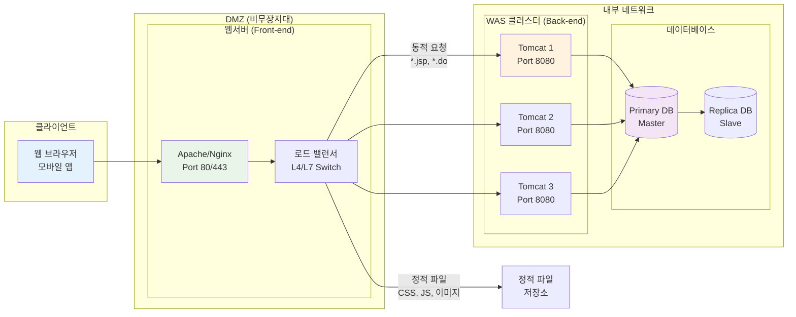
```mermaid
graph LR
    subgraph "클라이언트"
        Client[웹 브라우저<br/>모바일 앱]
    end
    
    subgraph "DMZ (비무장지대)"
        subgraph "웹서버 (Front-end)"
            WS1[Apache/Nginx<br/>Port 80/443]
            WS2[로드 밸런서<br/>L4/L7 Switch]
        end
    end
    
    subgraph "내부 네트워크"
        subgraph "WAS 클러스터 (Back-end)"
            WAS1[Tomcat 1<br/>Port 8080]
            WAS2[Tomcat 2<br/>Port 8080]
            WAS3[Tomcat 3<br/>Port 8080]
        end
        
        subgraph "데이터베이스"
            DB1[(Primary DB<br/>Master)]
            DB2[(Replica DB<br/>Slave)]
        end
    end
    
    Client --> WS1
    WS1 --> WS2
    
    WS2 -->|정적 파일<br/>CSS, JS, 이미지| Static[정적 파일<br/>저장소]
    WS2 -->|동적 요청<br/>*.jsp, *.do| WAS1
    WS2 --> WAS2
    WS2 --> WAS3
    
    WAS1 --> DB1
    WAS2 --> DB1
    WAS3 --> DB1
    
    DB1 --> DB2
    
    style Client fill:#e3f2fd
    style WS1 fill:#e8f5e8
    style WAS1 fill:#fff3e0
    style DB1 fill:#f3e5f5
```

#### 분리하는 이유와 장점

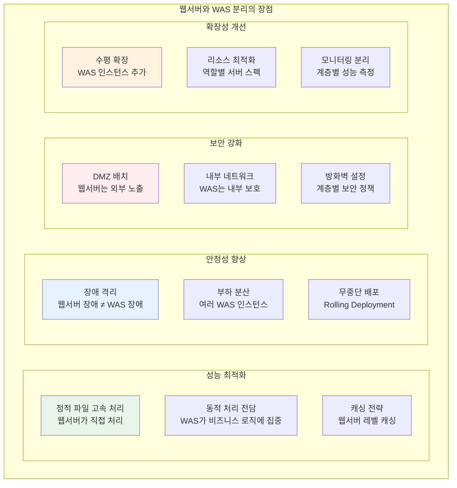
```mermaid
graph TB
    subgraph "웹서버와 WAS 분리의 장점"
        subgraph "성능 최적화"
            P1[정적 파일 고속 처리<br/>웹서버가 직접 처리]
            P2[동적 처리 전담<br/>WAS가 비즈니스 로직에 집중]
            P3[캐싱 전략<br/>웹서버 레벨 캐싱]
        end
        
        subgraph "안정성 향상"
            S1[장애 격리<br/>웹서버 장애 ≠ WAS 장애]
            S2[부하 분산<br/>여러 WAS 인스턴스]
            S3[무중단 배포<br/>Rolling Deployment]
        end
        
        subgraph "보안 강화"
            SE1[DMZ 배치<br/>웹서버는 외부 노출]
            SE2[내부 네트워크<br/>WAS는 내부 보호]
            SE3[방화벽 설정<br/>계층별 보안 정책]
        end
        
        subgraph "확장성 개선"
            SC1[수평 확장<br/>WAS 인스턴스 추가]
            SC2[리소스 최적화<br/>역할별 서버 스펙]
            SC3[모니터링 분리<br/>계층별 성능 측정]
        end
    end
    
    style P1 fill:#e8f5e8
    style S1 fill:#e3f2fd
    style SE1 fill:#ffebee
    style SC1 fill:#fff3e0
```

---


## 섹션 4-5: 서블릿 컨테이너 & Eclipse 개발환경

---

# 4. 서블릿 컨테이너와 서블릿

## 개요
서블릿 컨테이너의 역할과 서블릿의 기본 개념을 이해합니다.

### 4.1 서블릿 컨테이너 개념

#### 서블릿 컨테이너란?
- **정의**: 서블릿의 생명주기를 관리하고 실행 환경을 제공하는 프로그램
- **별칭**: 웹 컨테이너(Web Container)
- **역할**: 서블릿과 웹서버 사이의 통신 지원, 서블릿 생명주기 관리

#### 서블릿 컨테이너의 주요 기능

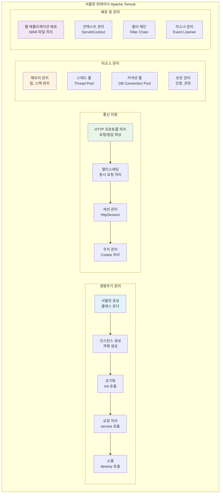
```mermaid
graph TB
    subgraph ServletContainer["서블릿 컨테이너 Apache Tomcat"]
        subgraph LifecycleManagement["생명주기 관리"]
            A[서블릿 로딩<br/>클래스 로더]
            B[인스턴스 생성<br/>객체 생성]
            C[초기화<br/>init 호출]
            D[요청 처리<br/>service 호출]
            E[소멸<br/>destroy 호출]
        end
        
        subgraph CommunicationSupport["통신 지원"]
            F[HTTP 프로토콜 처리<br/>요청/응답 파싱]
            G[멀티스레딩<br/>동시 요청 처리]
            H[세션 관리<br/>HttpSession]
            I[쿠키 관리<br/>Cookie 처리]
        end
        
        subgraph ResourceManagement["리소스 관리"]
            J[메모리 관리<br/>힙, 스택 관리]
            K[스레드 풀<br/>Thread Pool]
            L[커넥션 풀<br/>DB Connection Pool]
            M[보안 관리<br/>인증, 권한]
        end
        
        subgraph DeploymentManagement["배포 및 관리"]
            N[웹 애플리케이션 배포<br/>WAR 파일 처리]
            O[컨텍스트 관리<br/>ServletContext]
            P[필터 체인<br/>Filter Chain]
            Q[리스너 관리<br/>Event Listener]
        end
    end
    
    A --> B --> C --> D --> E
    F --> G
    G --> H
    H --> I
    
    style A fill:#e3f2fd
    style F fill:#e8f5e8
    style J fill:#fff3e0
    style N fill:#f3e5f5
```

#### 서블릿 컨테이너 내부 구조

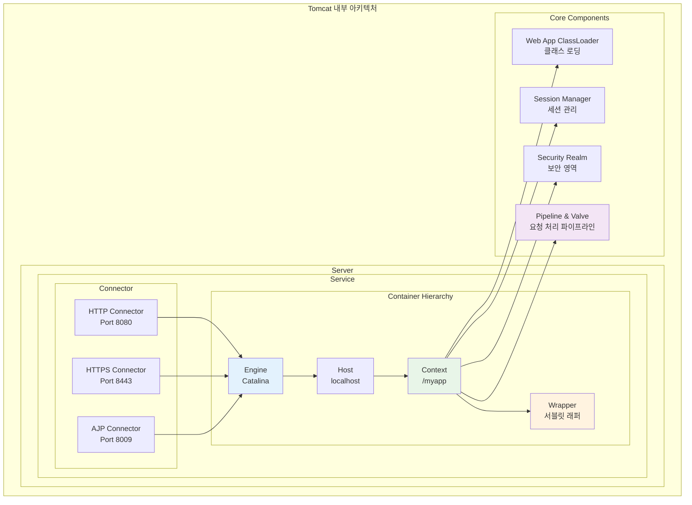
```mermaid
graph TB
    subgraph "Tomcat 내부 아키텍처"
        subgraph "Server"
            subgraph "Service"
                subgraph "Connector"
                    C1[HTTP Connector<br/>Port 8080]
                    C2[HTTPS Connector<br/>Port 8443]
                    C3[AJP Connector<br/>Port 8009]
                end
                
                subgraph "Container Hierarchy"
                    Engine[Engine<br/>Catalina]
                    Host[Host<br/>localhost]
                    Context[Context<br/>/myapp]
                    Wrapper[Wrapper<br/>서블릿 래퍼]
                end
            end
        end
        
        subgraph "Core Components"
            ClassLoader[Web App ClassLoader<br/>클래스 로딩]
            SessionManager[Session Manager<br/>세션 관리]
            SecurityRealm[Security Realm<br/>보안 영역]
            Pipeline[Pipeline & Valve<br/>요청 처리 파이프라인]
        end
    end
    
    C1 --> Engine
    C2 --> Engine
    C3 --> Engine
    
    Engine --> Host
    Host --> Context
    Context --> Wrapper
    
    Context --> ClassLoader
    Context --> SessionManager
    Context --> SecurityRealm
    Context --> Pipeline
    
    style Engine fill:#e3f2fd
    style Context fill:#e8f5e8
    style Wrapper fill:#fff3e0
    style Pipeline fill:#f3e5f5
```

#### 멀티스레딩 처리 모델

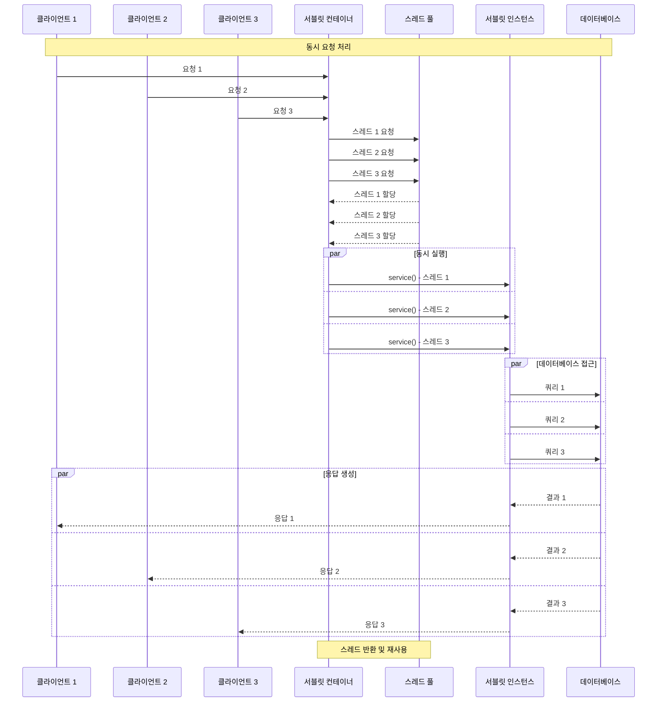
```mermaid
sequenceDiagram
    participant C1 as 클라이언트 1
    participant C2 as 클라이언트 2
    participant C3 as 클라이언트 3
    participant Container as 서블릿 컨테이너
    participant ThreadPool as 스레드 풀
    participant Servlet as 서블릿 인스턴스
    participant DB as 데이터베이스

    Note over C1,DB: 동시 요청 처리
    
    C1->>Container: 요청 1
    C2->>Container: 요청 2
    C3->>Container: 요청 3
    
    Container->>ThreadPool: 스레드 1 요청
    Container->>ThreadPool: 스레드 2 요청
    Container->>ThreadPool: 스레드 3 요청
    
    ThreadPool-->>Container: 스레드 1 할당
    ThreadPool-->>Container: 스레드 2 할당
    ThreadPool-->>Container: 스레드 3 할당
    
    par 동시 실행
        Container->>Servlet: service() - 스레드 1
        and
        Container->>Servlet: service() - 스레드 2
        and
        Container->>Servlet: service() - 스레드 3
    end
    
    par 데이터베이스 접근
        Servlet->>DB: 쿼리 1
        and
        Servlet->>DB: 쿼리 2
        and
        Servlet->>DB: 쿼리 3
    end
    
    par 응답 생성
        DB-->>Servlet: 결과 1
        Servlet-->>C1: 응답 1
        and
        DB-->>Servlet: 결과 2
        Servlet-->>C2: 응답 2
        and
        DB-->>Servlet: 결과 3
        Servlet-->>C3: 응답 3
    end
    
    Note over Container,ThreadPool: 스레드 반환 및 재사용
```

### 4.2 서블릿(Servlet) 기본 개념

#### 서블릿 클래스 계층 구조


```mermaid
graph TB
    subgraph "서블릿 인터페이스 계층"
        A[Servlet<br/>인터페이스]
        B[GenericServlet<br/>추상 클래스]
        C[HttpServlet<br/>추상 클래스]
        D[MyServlet<br/>사용자 정의 서블릿]
    end
    
    subgraph "주요 메서드"
        E[init&#40;&#41;<br/>초기화]
        F[service&#40;&#41;<br/>요청 처리]
        G[destroy&#40;&#41;<br/>소멸]
        H[doGet&#40;&#41;<br/>GET 요청 처리]
        I[doPost&#40;&#41;<br/>POST 요청 처리]
        J[doPut&#40;&#41;<br/>PUT 요청 처리]
        K[doDelete&#40;&#41;<br/>DELETE 요청 처리]
    end
    
    A --> B
    B --> C
    C --> D
    
    A --> E
    A --> F
    A --> G
    C --> H
    C --> I
    C --> J
    C --> K
    
    style A fill:#e3f2fd
    style C fill:#e8f5e8
    style D fill:#fff3e0
    style H fill:#f3e5f5
```

#### 서블릿 vs 다른 웹 기술 비교

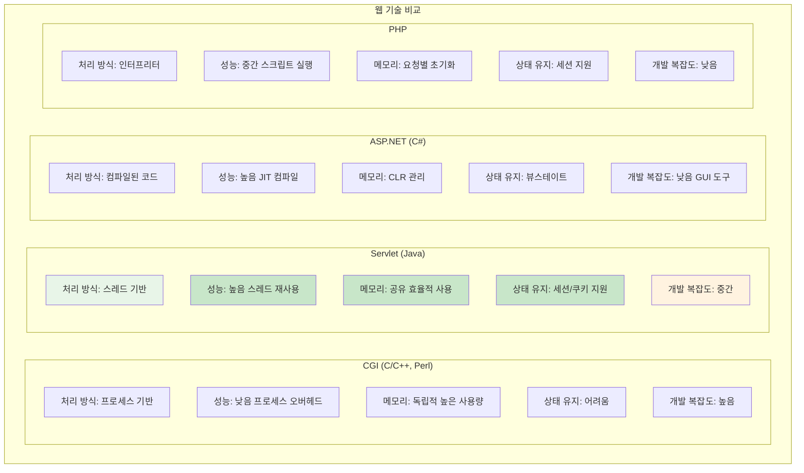
```mermaid
graph TB
    subgraph WebTechComparison["웹 기술 비교"]
        subgraph CGI["CGI (C/C++, Perl)"]
            CG1[처리 방식: 프로세스 기반]
            CG2[성능: 낮음 프로세스 오버헤드]
            CG3[메모리: 독립적 높은 사용량]
            CG4[상태 유지: 어려움]
            CG5[개발 복잡도: 높음]
        end
        
        subgraph Servlet["Servlet (Java)"]
            SV1[처리 방식: 스레드 기반]
            SV2[성능: 높음 스레드 재사용]
            SV3[메모리: 공유 효율적 사용]
            SV4[상태 유지: 세션/쿠키 지원]
            SV5[개발 복잡도: 중간]
        end
        
        subgraph ASPNET["ASP.NET (C#)"]
            AS1[처리 방식: 컴파일된 코드]
            AS2[성능: 높음 JIT 컴파일]
            AS3[메모리: CLR 관리]
            AS4[상태 유지: 뷰스테이트]
            AS5[개발 복잡도: 낮음 GUI 도구]
        end
        
        subgraph PHP["PHP"]
            PH1[처리 방식: 인터프리터]
            PH2[성능: 중간 스크립트 실행]
            PH3[메모리: 요청별 초기화]
            PH4[상태 유지: 세션 지원]
            PH5[개발 복잡도: 낮음]
        end
    end
    
    style SV1 fill:#e8f5e8
    style SV2 fill:#c8e6c9
    style SV3 fill:#c8e6c9
    style SV4 fill:#c8e6c9
    style SV5 fill:#fff3e0
```

#### 서블릿 실행 환경

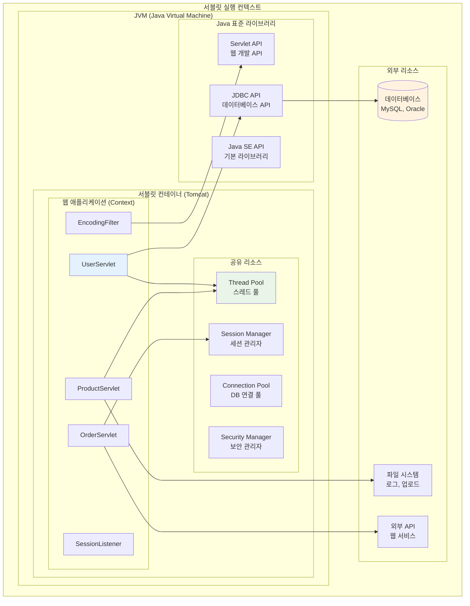
```mermaid
graph TB
    subgraph "서블릿 실행 컨텍스트"
        subgraph "JVM (Java Virtual Machine)"
            subgraph "서블릿 컨테이너 (Tomcat)"
                subgraph "웹 애플리케이션 (Context)"
                    Servlet1[UserServlet]
                    Servlet2[ProductServlet]
                    Servlet3[OrderServlet]
                    Filter1[EncodingFilter]
                    Listener1[SessionListener]
                end
                
                subgraph "공유 리소스"
                    ThreadPool[Thread Pool<br/>스레드 풀]
                    SessionManager[Session Manager<br/>세션 관리자]
                    ConnectionPool[Connection Pool<br/>DB 연결 풀]
                    SecurityManager[Security Manager<br/>보안 관리자]
                end
            end
            
            subgraph "Java 표준 라이브러리"
                JavaAPI[Java SE API<br/>기본 라이브러리]
                ServletAPI[Servlet API<br/>웹 개발 API]
                JDBCAPI[JDBC API<br/>데이터베이스 API]
            end
        end
        
        subgraph "외부 리소스"
            Database[(데이터베이스<br/>MySQL, Oracle)]
            FileSystem[파일 시스템<br/>로그, 업로드]
            ExternalAPI[외부 API<br/>웹 서비스]
        end
    end
    
    Servlet1 --> ThreadPool
    Servlet2 --> ThreadPool
    Servlet3 --> SessionManager
    Filter1 --> ServletAPI
    
    Servlet1 --> JDBCAPI
    JDBCAPI --> Database
    Servlet2 --> FileSystem
    Servlet3 --> ExternalAPI
    
    style Servlet1 fill:#e3f2fd
    style ThreadPool fill:#e8f5e8
    style Database fill:#fff3e0
```

---

# 5. Eclipse 개발환경 구축

## 개요
Eclipse IDE를 활용한 Java 웹 개발 환경 구축을 단계별로 상세히 설명합니다.

### 5.1 Eclipse 설치 및 기본 설정

#### Eclipse 개발 환경 구성

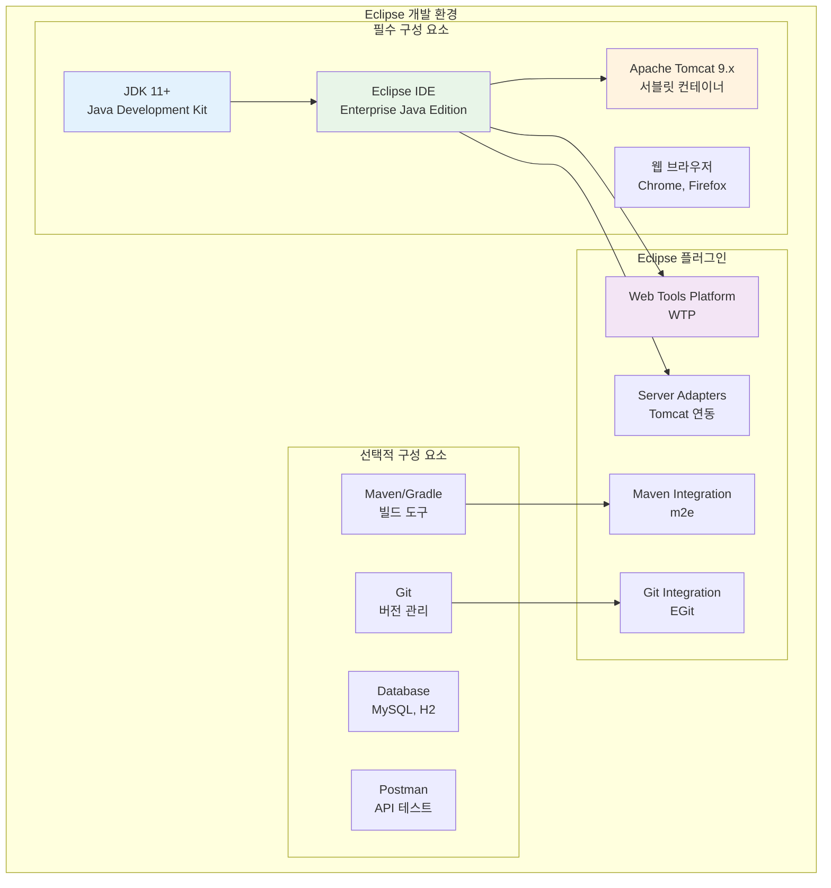
```mermaid
graph TB
    subgraph "Eclipse 개발 환경"
        subgraph "필수 구성 요소"
            A[JDK 11+<br/>Java Development Kit]
            B[Eclipse IDE<br/>Enterprise Java Edition]
            C[Apache Tomcat 9.x<br/>서블릿 컨테이너]
            D[웹 브라우저<br/>Chrome, Firefox]
        end
        
        subgraph "선택적 구성 요소"
            E[Maven/Gradle<br/>빌드 도구]
            F[Git<br/>버전 관리]
            G[Database<br/>MySQL, H2]
            H[Postman<br/>API 테스트]
        end
        
        subgraph "Eclipse 플러그인"
            I[Web Tools Platform<br/>WTP]
            J[Server Adapters<br/>Tomcat 연동]
            K[Maven Integration<br/>m2e]
            L[Git Integration<br/>EGit]
        end
    end
    
    A --> B
    B --> C
    B --> I
    B --> J
    E --> K
    F --> L
    
    style A fill:#e3f2fd
    style B fill:#e8f5e8
    style C fill:#fff3e0
    style I fill:#f3e5f5
```

#### 설치 및 설정 체크리스트

```mermaid
graph LR
    subgraph "설치 순서"
        Step1[1. JDK 설치<br/>java -version 확인]
        Step2[2. Eclipse 다운로드<br/>Enterprise Java Edition]
        Step3[3. Tomcat 다운로드<br/>Binary Distribution]
        Step4[4. Eclipse 설정<br/>인코딩, JRE 등]
        Step5[5. 서버 환경 구성<br/>Runtime Environment]
        Step6[6. 프로젝트 생성<br/>Dynamic Web Project]
    end
    
    Step1 --> Step2 --> Step3 --> Step4 --> Step5 --> Step6
    
    style Step1 fill:#e8f5e8
    style Step4 fill:#fff3e0
    style Step6 fill:#f3e5f5
```

### 5.2 서버 환경 설정

#### Tomcat 서버 설정 과정

```mermaid
sequenceDiagram
    participant Dev as 개발자
    participant Eclipse as Eclipse IDE
    participant Tomcat as Tomcat 서버
    participant Project as 웹 프로젝트

    Note over Dev,Project: 서버 환경 구성
    
    Dev->>Eclipse: 1. Runtime Environment 설정
    Eclipse->>Eclipse: 2. Tomcat 경로 지정<br/>JDK 선택
    
    Dev->>Eclipse: 3. Server Instance 생성
    Eclipse->>Tomcat: 4. 서버 인스턴스 생성<br/>포트 설정 (8080)
    
    Dev->>Eclipse: 5. 프로젝트 배포
    Eclipse->>Project: 6. Add and Remove<br/>프로젝트 선택
    
    Eclipse->>Tomcat: 7. 서버 시작
    Tomcat-->>Eclipse: 8. 시작 완료 응답<br/>Server startup in XXXXms
    
    Note over Dev,Project: 개발 환경 준비 완료
```

#### 서버 설정 상세 옵션

```mermaid
graph TB
    subgraph TomcatConfig["Tomcat 서버 설정"]
        subgraph ServerLocations["Server Locations"]
            SL1[Use Tomcat installation<br/>실제 Tomcat에 배포]
            SL2[Use workspace metadata<br/>개발용 권장]
            SL3[Use custom location<br/>사용자 정의]
        end
        
        subgraph ServerOptions["Server Options"]
            SO1[Serve modules without publishing<br/>빠른 개발]
            SO2[Automatically publish<br/>자동 배포]
            SO3[Enable security<br/>보안 활성화]
        end
        
        subgraph PortConfig["Port Configuration"]
            PC1[HTTP/1.1: 8080<br/>웹 접근 포트]
            PC2[HTTPS/1.1: 8443<br/>SSL 포트]
            PC3[AJP/1.3: 8009<br/>Apache 연동]
            PC4[Server Shutdown: 8005<br/>종료 포트]
        end
        
        subgraph JVMOptions["JVM Options"]
            JVM1[-Xms512m -Xmx1024m<br/>힙 메모리 설정]
            JVM2[-Dfile.encoding=UTF-8<br/>파일 인코딩]
            JVM3[-Duser.timezone=Asia/Seoul<br/>시간대 설정]
        end
    end
    
    style SL2 fill:#c8e6c9
    style SO1 fill:#c8e6c9
    style PC1 fill:#e3f2fd
    style JVM1 fill:#fff3e0
```

### 5.3 Dynamic Web Project 생성

#### 프로젝트 구조

```mermaid
graph TB
    subgraph "Dynamic Web Project 구조"
        subgraph "Source Folders"
            SF1[src/main/java<br/>Java 소스 코드]
            SF2[src/main/resources<br/>설정 파일, 프로퍼티]
            SF3[src/test/java<br/>JUnit 테스트 코드]
        end
        
        subgraph "Web Content"
            WC1[src/main/webapp<br/>웹 리소스 루트]
            WC2[WEB-INF/web.xml<br/>배포 설정 파일]
            WC3[WEB-INF/lib/<br/>JAR 라이브러리]
            WC4[WEB-INF/classes/<br/>컴파일된 클래스]
        end
        
        subgraph "Static Resources"
            SR1[css/<br/>스타일시트]
            SR2[js/<br/>JavaScript]
            SR3[images/<br/>이미지 파일]
            SR4[jsp/<br/>JSP 페이지]
        end
        
        subgraph "Build Output"
            BO1[build/classes<br/>컴파일 결과]
            BO2[*.war<br/>배포 아카이브]
        end
    end
    
    SF1 --> BO1
    WC1 --> WC2
    WC1 --> SR1
    WC1 --> SR2
    WC1 --> SR3
    WC1 --> SR4
    BO1 --> BO2
    
    style SF1 fill:#e3f2fd
    style WC2 fill:#ffebee
    style SR1 fill:#e8f5e8
    style BO1 fill:#fff3e0
```

#### 패키지 구조 권장사항

```mermaid
graph TB
    subgraph "Java 패키지 구조"
        Root[com.example.myapp]
        
        subgraph "웹 계층"
            Web1[servlet/<br/>서블릿 클래스]
            Web2[filter/<br/>필터 클래스]
            Web3[listener/<br/>리스너 클래스]
        end
        
        subgraph "비즈니스 계층"
            Biz1[service/<br/>비즈니스 로직]
            Biz2[dto/<br/>데이터 전송 객체]
            Biz3[exception/<br/>사용자 정의 예외]
        end
        
        subgraph "데이터 계층"
            Data1[dao/<br/>데이터 접근 객체]
            Data2[model/<br/>엔티티 클래스]
            Data3[config/<br/>데이터베이스 설정]
        end
        
        subgraph "유틸리티"
            Util1[util/<br/>유틸리티 클래스]
            Util2[constant/<br/>상수 클래스]
            Util3[helper/<br/>헬퍼 클래스]
        end
    end
    
    Root --> Web1
    Root --> Web2
    Root --> Web3
    Root --> Biz1
    Root --> Biz2
    Root --> Biz3
    Root --> Data1
    Root --> Data2
    Root --> Data3
    Root --> Util1
    Root --> Util2
    Root --> Util3
    
    style Web1 fill:#e3f2fd
    style Biz1 fill:#e8f5e8
    style Data1 fill:#fff3e0
    style Util1 fill:#f3e5f5
```

### 5.4 개발 효율성 설정

#### Hot Deploy 및 디버깅 설정

```mermaid
graph LR
    subgraph "개발 효율성 기능"
        subgraph "Hot Deploy"
            HD1[Serve modules without publishing<br/>즉시 반영]
            HD2[Automatic publishing<br/>자동 배포]
            HD3[Publishing interval: 1s<br/>배포 간격]
        end
        
        subgraph "디버깅"
            DBG1[Debug Mode<br/>디버그 모드 실행]
            DBG2[Breakpoint<br/>중단점 설정]
            DBG3[Hot Swap<br/>런타임 코드 변경]
        end
        
        subgraph "코드 지원"
            CS1[Auto Complete<br/>자동 완성]
            CS2[Code Template<br/>코드 템플릿]
            CS3[Quick Fix<br/>빠른 수정]
        end
        
        subgraph "성능 최적화"
            PO1[Build Path 최적화<br/>라이브러리 관리]
            PO2[Memory 설정<br/>-Xmx 조정]
            PO3[Index 관리<br/>검색 최적화]
        end
    end
    
    style HD1 fill:#c8e6c9
    style DBG1 fill:#e3f2fd
    style CS1 fill:#fff3e0
    style PO1 fill:#f3e5f5
```

#### 유용한 단축키 모음

```mermaid
graph TB
    subgraph "Eclipse 단축키"
        subgraph "파일 관리"
            F1[Ctrl + N<br/>새 파일/프로젝트]
            F2[Ctrl + Shift + R<br/>리소스 열기]
            F3[Ctrl + Shift + T<br/>타입 열기]
            F4[Alt + Enter<br/>Properties]
        end
        
        subgraph "코드 편집"
            C1[Ctrl + Space<br/>자동 완성]
            C2[Ctrl + 1<br/>Quick Fix]
            C3[Ctrl + Shift + F<br/>코드 포맷팅]
            C4[Ctrl + Shift + O<br/>Import 정리]
        end
        
        subgraph "네비게이션"
            N1[F3<br/>선언부로 이동]
            N2[Ctrl + T<br/>타입 계층]
            N3[Ctrl + O<br/>아웃라인]
            N4[Alt + ←/→<br/>이전/다음 위치]
        end
        
        subgraph "디버깅"
            D1[F5<br/>Step Into]
            D2[F6<br/>Step Over]
            D3[F7<br/>Step Return]
            D4[F8<br/>Resume]
        end
    end
    
    style F1 fill:#e8f5e8
    style C1 fill:#e3f2fd
    style N1 fill:#fff3e0
    style D1 fill:#f3e5f5
```

### 5.5 프로젝트 배포 및 실행

#### 배포 프로세스

```mermaid
sequenceDiagram
    participant Dev as 개발자
    participant Eclipse as Eclipse
    participant Tomcat as Tomcat 서버
    participant Browser as 브라우저

    Note over Dev,Browser: 개발 및 테스트 사이클
    
    Dev->>Eclipse: 1. 코드 작성/수정
    Eclipse->>Eclipse: 2. 자동 컴파일<br/>*.java → *.class
    
    alt Hot Deploy 활성화
        Eclipse->>Tomcat: 3. 자동 배포<br/>변경사항 감지
        Note over Tomcat: 서버 재시작 없이<br/>변경사항 반영
    else 수동 배포
        Dev->>Eclipse: 3. 서버 재시작
        Eclipse->>Tomcat: 4. 전체 재배포
    end
    
    Dev->>Browser: 5. 브라우저에서 테스트<br/>http://localhost:8080/myapp
    Browser->>Tomcat: 6. HTTP 요청
    Tomcat-->>Browser: 7. HTTP 응답
    
    Note over Dev,Browser: 결과 확인 및 디버깅
```

---

# 6. Servlet 기초

## 개요
서블릿의 기본 사용법과 생명주기를 상세히 학습합니다.

### 6.1 서블릿 생명주기

#### 생명주기 개요
서블릿은 생성부터 소멸까지 정해진 단계를 거치며, 각 단계마다 특정 메서드가 호출됩니다.

#### 서블릿 생명주기 다이어그램

```mermaid
stateDiagram-v2
    [*] --> Loading: 최초 요청 또는<br/>서버 시작 시
    Loading --> Instantiation: 클래스 로딩 완료
    Instantiation --> Initialization: 객체 생성 완료
    Initialization --> Service: init() 호출 완료
    Service --> Service: 각 요청마다<br/>service() 호출
    Service --> Destruction: 서버 종료 또는<br/>애플리케이션 언로드
    Destruction --> [*]: destroy() 호출 완료
    
    note right of Loading : 클래스 로더가<br/>서블릿 클래스를 메모리에 로드
    note right of Instantiation : 서블릿 인스턴스 생성<br/>(일반적으로 하나만)
    note right of Initialization : 초기화 작업 수행<br/>DB 연결, 설정 로드 등
    note right of Service : 실제 요청 처리<br/>멀티스레드 환경
    note right of Destruction : 정리 작업 수행<br/>리소스 해제
```

#### 생명주기 단계별 특징

```mermaid
graph TB
    subgraph Lifecycle["서블릿 생명주기 단계"]
        subgraph Loading["1. 로딩 Loading"]
            L1[시점: 최초 요청 또는 서버 시작]
            L2[작업: 클래스 파일을 메모리에 로드]
            L3[조건: load-on-startup 설정]
            L4[횟수: 애플리케이션당 1회]
        end
        
        subgraph Instantiation["2. 인스턴스화 Instantiation"]
            I1[시점: 클래스 로딩 직후]
            I2[작업: 기본 생성자 호출]
            I3[조건: public 기본 생성자 필수]
            I4[횟수: 일반적으로 1개 인스턴스]
        end
        
        subgraph Initialization["3. 초기화 Initialization"]
            IN1[시점: 인스턴스 생성 직후]
            IN2[작업: init 메서드 호출]
            IN3[조건: ServletConfig 파라미터 전달]
            IN4[횟수: 인스턴스당 1회]
        end
        
        subgraph Service["4. 서비스 Service"]
            S1[시점: 클라이언트 요청마다]
            S2[작업: service 메서드 호출]
            S3[조건: 멀티스레드 환경]
            S4[횟수: 요청 수만큼 반복]
        end
        
        subgraph Destruction["5. 소멸 Destruction"]
            D1[시점: 서버 종료 또는 언로드]
            D2[작업: destroy 메서드 호출]
            D3[조건: 정리 작업 수행]
            D4[횟수: 인스턴스당 1회]
        end
    end
    
    L1 --> I1
    I1 --> IN1
    IN1 --> S1
    S1 --> S1
    S1 --> D1
    
    style L1 fill:#e3f2fd
    style I1 fill:#e8f5e8
    style IN1 fill:#fff3e0
    style S1 fill:#f3e5f5
    style D1 fill:#ffebee
```

#### 생명주기 실습 예제
```java
@WebServlet(value = "/lifecycle", loadOnStartup = 1)
public class LifecycleServlet extends HttpServlet {
    
    private static int instanceCount = 0;
    private int serviceCount = 0;
    private String instanceId;
    
    // 생성자
    public LifecycleServlet() {
        instanceId = "Instance-" + (++instanceCount);
        System.out.println("[" + instanceId + "] 생성자 호출됨");
    }
    
    @Override
    public void init() throws ServletException {
        System.out.println("[" + instanceId + "] init() 메서드 호출됨");
    }
    
    @Override
    protected void service(HttpServletRequest req, HttpServletResponse resp) 
            throws ServletException, IOException {
        serviceCount++;
        System.out.println("[" + instanceId + "] service() 호출 (횟수: " + serviceCount + ")");
        super.service(req, resp);
    }
    
    @Override
    protected void doGet(HttpServletRequest request, HttpServletResponse response) 
            throws ServletException, IOException {
        
        response.setContentType("text/html;charset=UTF-8");
        PrintWriter out = response.getWriter();
        
        out.println("<html><body>");
        out.println("<h2>서블릿 생명주기 테스트</h2>");
        out.println("<p>인스턴스 ID: " + instanceId + "</p>");
        out.println("<p>서비스 호출 횟수: " + serviceCount + "</p>");
        out.println("<p>현재 시간: " + new java.util.Date() + "</p>");
        out.println("</body></html>");
    }
    
    @Override
    public void destroy() {
        System.out.println("[" + instanceId + "] destroy() 호출 (총 처리: " + serviceCount + "회)");
    }
}
```

### 6.2 HTTP 요청/응답 처리

#### HTTP 요청 처리 흐름

```mermaid
sequenceDiagram
    participant Client as 클라이언트
    participant Container as 서블릿 컨테이너
    participant Servlet as 서블릿
    participant Request as HttpServletRequest
    participant Response as HttpServletResponse

    Client->>Container: HTTP 요청<br/>POST /user/create
    Container->>Request: 요청 객체 생성<br/>파라미터, 헤더 파싱
    Container->>Response: 응답 객체 생성<br/>초기 상태 설정
    Container->>Servlet: service() 호출<br/>(request, response)
    
    Servlet->>Request: 요청 분석<br/>getMethod(), getParameter()
    Request-->>Servlet: 요청 데이터 반환
    
    Note over Servlet: HTTP 메서드별 분기<br/>doGet(), doPost(), doPut(), doDelete()
    
    Servlet->>Servlet: 비즈니스 로직 처리<br/>데이터 검증, DB 처리
    Servlet->>Response: 응답 생성<br/>setContentType(), getWriter()
    Response-->>Client: HTTP 응답<br/>HTML, JSON 등
```

#### 요청 정보 추출 예제
```java
public class RequestAnalysisServlet extends HttpServlet {
    
    @Override
    protected void doGet(HttpServletRequest request, HttpServletResponse response) 
            throws ServletException, IOException {
        
        // 기본 요청 정보
        analyzeBasicRequestInfo(request);
        
        // 헤더 정보 분석
        analyzeHeaders(request);
        
        // 파라미터 분석
        analyzeParameters(request);
        
        // 클라이언트 정보 분석
        analyzeClientInfo(request);
        
        generateResponse(request, response);
    }
    
    private void analyzeBasicRequestInfo(HttpServletRequest request) {
        System.out.println("=== 기본 요청 정보 ===");
        System.out.println("HTTP 메서드: " + request.getMethod());
        System.out.println("요청 URI: " + request.getRequestURI());
        System.out.println("요청 URL: " + request.getRequestURL());
        System.out.println("컨텍스트 경로: " + request.getContextPath());
        System.out.println("서블릿 경로: " + request.getServletPath());
        System.out.println("경로 정보: " + request.getPathInfo());
        System.out.println("쿼리 스트링: " + request.getQueryString());
        System.out.println("프로토콜: " + request.getProtocol());
        System.out.println("스키마: " + request.getScheme());
        System.out.println("보안 연결: " + request.isSecure());
    }
}
```

### 6.3 HTTP 메서드별 처리

#### GET 요청 처리 패턴

```mermaid
graph TB
    subgraph GetPattern["GET 요청 처리 패턴"]
        A[GET /user] --> B{URL 패턴 분석}
        B -->|/user| C[사용자 목록 조회]
        B -->|/user/123| D[특정 사용자 조회]
        B -->|/user/search| E[사용자 검색]
        
        C --> F[UserService.getAllUsers]
        D --> G[UserService.getUserById]
        E --> H[UserService.searchUsers]
        
        F --> I[JSP 포워드]
        G --> I
        H --> I
        
        I --> J[HTML 응답]
    end
    
    style A fill:#e3f2fd
    style B fill:#fff3e0
    style I fill:#e8f5e8
```

#### POST 요청 처리 패턴

```mermaid
graph TB
    subgraph "POST 요청 처리 패턴"
        A[POST /user] --> B[파라미터 추출]
        B --> C[입력 검증]
        C --> D{검증 결과}
        D -->|성공| E[비즈니스 로직 처리]
        D -->|실패| F[오류 메시지와 함께<br/>입력 폼으로 포워드]
        
        E --> G[데이터베이스 처리]
        G --> H{처리 결과}
        H -->|성공| I[성공 페이지로 리다이렉트]
        H -->|실패| J[오류 페이지로 포워드]
    end
    
    style A fill:#e3f2fd
    style C fill:#fff3e0
    style E fill:#e8f5e8
    style I fill:#c8e6c9
```

### 6.4 세션과 쿠키 관리

#### 세션 생명주기

```mermaid
sequenceDiagram
    participant Client as 클라이언트
    participant Servlet as 서블릿
    participant Session as HttpSession
    participant SessionManager as 세션 매니저

    Note over Client,SessionManager: 세션 생성 및 관리
    
    Client->>Servlet: 첫 번째 요청<br/>(세션 없음)
    Servlet->>SessionManager: getSession(true) 호출
    SessionManager->>Session: 새 세션 생성<br/>고유 ID 부여
    SessionManager-->>Servlet: 세션 객체 반환
    Servlet->>Session: 데이터 저장<br/>setAttribute("user", user)
    Servlet-->>Client: 응답 + 세션 쿠키<br/>Set-Cookie: JSESSIONID=...
    
    Note over Client,SessionManager: 후속 요청 처리
    
    Client->>Servlet: 두 번째 요청<br/>Cookie: JSESSIONID=...
    Servlet->>SessionManager: getSession(false) 호출
    SessionManager-->>Servlet: 기존 세션 반환
    Servlet->>Session: 데이터 조회<br/>getAttribute("user")
    Session-->>Servlet: 저장된 데이터 반환
    
    Note over Client,SessionManager: 세션 만료/무효화
    
    alt 세션 타임아웃
        SessionManager->>Session: 자동 만료<br/>maxInactiveInterval 초과
    else 명시적 무효화
        Servlet->>Session: invalidate() 호출
    end
    
    Session->>SessionManager: 세션 삭제
```

---

# 7. Servlet 심화

## 개요
서블릿의 고급 기능과 실무에서 자주 사용되는 패턴들을 학습합니다.

### 7.1 필터(Filter)와 리스너(Listener)

#### 필터 동작 원리

```mermaid
sequenceDiagram
    participant Client as 클라이언트
    participant Filter1 as 필터1<br/>(인코딩)
    participant Filter2 as 필터2<br/>(인증)
    participant Filter3 as 필터3<br/>(로깅)
    participant Servlet as 서블릿

    Note over Client,Servlet: 요청 처리 흐름 (Forward)
    Client->>Filter1: HTTP 요청
    Filter1->>Filter1: 인코딩 설정<br/>UTF-8 적용
    Filter1->>Filter2: chain.doFilter()
    Filter2->>Filter2: 인증 검사<br/>세션 확인
    Filter2->>Filter3: chain.doFilter()
    Filter3->>Filter3: 요청 로깅<br/>시작 시간 기록
    Filter3->>Servlet: chain.doFilter()
    Servlet->>Servlet: 비즈니스 로직 수행<br/>doGet(), doPost()
    
    Note over Client,Servlet: 응답 처리 흐름 (Backward)
    Servlet-->>Filter3: HTTP 응답
    Filter3->>Filter3: 응답 로깅<br/>처리 시간 계산
    Filter3-->>Filter2: 응답 전달
    Filter2->>Filter2: 후처리<br/>보안 헤더 추가
    Filter2-->>Filter1: 응답 전달
    Filter1->>Filter1: 압축 처리<br/>Gzip 적용
    Filter1-->>Client: HTTP 응답

    Note over Client,Servlet: 필터 체인은 양방향으로 동작
```

#### 필터 체인 구조

```mermaid
graph TB
    subgraph "필터 체인 아키텍처"
        Client[클라이언트 요청] --> FilterChain[필터 체인]
        
        subgraph "Filter Chain"
            F1[EncodingFilter<br/>문자 인코딩]
            F2[AuthenticationFilter<br/>인증 검사]
            F3[AuthorizationFilter<br/>권한 검사]
            F4[LoggingFilter<br/>로그 기록]
            F5[CompressionFilter<br/>응답 압축]
        end
        
        FilterChain --> F1
        F1 --> F2
        F2 --> F3
        F3 --> F4
        F4 --> F5
        F5 --> Servlet[타겟 서블릿]
        
        Servlet --> Response[응답 생성]
        Response --> F5
        F5 --> F4
        F4 --> F3
        F3 --> F2
        F2 --> F1
        F1 --> Client
    end
    
    style F1 fill:#e3f2fd
    style F2 fill:#ffebee
    style F3 fill:#fff3e0
    style F4 fill:#e8f5e8
    style F5 fill:#f3e5f5
```

#### 리스너 이벤트 처리 흐름

```mermaid
sequenceDiagram
    participant Server as 서버
    participant Context as ServletContext
    participant Session as HttpSession
    participant Request as HttpServletRequest
    participant Listener as 리스너들

    Note over Server,Listener: 애플리케이션 생명주기
    Server->>Context: 애플리케이션 시작
    Context->>Listener: contextInitialized() 호출
    Listener->>Listener: 초기화 작업 수행<br/>DB 풀, 캐시 등 설정
    
    Note over Server,Listener: 사용자 세션 관리
    Context->>Session: 새 세션 생성
    Session->>Listener: sessionCreated() 호출
    Listener->>Listener: 세션 통계 업데이트<br/>사용자 카운트 증가
    
    Note over Server,Listener: 요청 처리
    Session->>Request: 새 요청 시작
    Request->>Listener: requestInitialized() 호출
    Listener->>Listener: 요청 로깅<br/>성능 측정 시작
    
    Note over Request: 요청 처리 완료
    Request->>Listener: requestDestroyed() 호출
    Listener->>Listener: 처리 시간 계산<br/>로그 기록
    
    Note over Server,Listener: 세션 종료
    Session->>Listener: sessionDestroyed() 호출
    Listener->>Listener: 세션 통계 업데이트<br/>사용자 카운트 감소
    
    Note over Server,Listener: 애플리케이션 종료
    Context->>Listener: contextDestroyed() 호출
    Listener->>Listener: 정리 작업 수행<br/>리소스 해제
    Server->>Context: 애플리케이션 종료
```

### 7.2 비동기 서블릿 (Async Servlet)

#### 비동기 처리 흐름

```mermaid
sequenceDiagram
    participant Client as 클라이언트
    participant Container as 서블릿 컨테이너
    participant ServletThread as 서블릿 스레드
    participant AsyncContext as 비동기 컨텍스트
    participant WorkerThread as 작업 스레드
    participant Database as 데이터베이스

    Client->>Container: HTTP 요청
    Container->>ServletThread: 스레드 할당
    ServletThread->>AsyncContext: startAsync() 호출
    
    Note over ServletThread: 비동기 컨텍스트 생성
    ServletThread->>WorkerThread: 비동기 작업 제출<br/>executorService.submit()
    ServletThread-->>Container: 서블릿 스레드 반환<br/>(연결은 유지)
    
    Note over WorkerThread: 별도 스레드에서 긴 작업 수행
    WorkerThread->>Database: 긴 작업 수행<br/>(DB 조회, 외부 API 호출 등)
    Database-->>WorkerThread: 작업 결과
    
    WorkerThread->>AsyncContext: 응답 생성<br/>response.getWriter()
    AsyncContext->>AsyncContext: complete() 호출
    AsyncContext-->>Client: HTTP 응답 전송
    
    Note over Client,Database: 서블릿 스레드는 다른 요청 처리 가능
```

#### 동기 vs 비동기 서블릿 비교

```mermaid
graph TB
    subgraph "동기 서블릿 처리"
        subgraph "Thread Pool (크기: 200)"
            T1[Thread 1<br/>요청 처리 중<br/>3초 대기]
            T2[Thread 2<br/>요청 처리 중<br/>5초 대기]
            T3[Thread 3<br/>요청 처리 중<br/>2초 대기]
            T4[...]
            T200[Thread 200<br/>모든 스레드 사용]
        end
        
        Problem1[문제점]
        Problem1 --> P1[스레드 풀 고갈<br/>새 요청 대기]
        Problem1 --> P2[메모리 사용량 증가<br/>스레드당 1MB]
        Problem1 --> P3[컨텍스트 스위칭<br/>오버헤드]
    end
    
    subgraph "비동기 서블릿 처리"
        subgraph "Thread Pool (크기: 200)"
            AT1[Thread 1<br/>즉시 반환]
            AT2[Thread 2<br/>즉시 반환]
            AT3[Thread 3<br/>즉시 반환]
            AT4[...]
            AT200[Thread 200<br/>사용 가능]
        end
        
        subgraph "Worker Thread Pool"
            WT1[Worker 1<br/>긴 작업 수행]
            WT2[Worker 2<br/>긴 작업 수행]
            WT3[Worker 3<br/>긴 작업 수행]
        end
        
        Advantage[장점]
        Advantage --> A1[높은 동시성<br/>더 많은 연결 처리]
        Advantage --> A2[효율적 리소스 사용<br/>스레드 재사용]
        Advantage --> A3[확장성 향상<br/>시스템 안정성]
    end
    
    style T1 fill:#ffebee
    style P1 fill:#ffcdd2
    style AT1 fill:#e8f5e8
    style A1 fill:#c8e6c9
```

### 7.3 파일 업로드/다운로드

#### 파일 업로드 처리 과정

```mermaid
sequenceDiagram
    participant Browser as 브라우저
    participant Server as 서블릿
    participant FileSystem as 파일 시스템
    participant Validator as 검증기
    participant DB as 데이터베이스

    Note over Browser,DB: 파일 업로드 전체 흐름
    
    Browser->>Server: Multipart/form-data 요청<br/>POST /upload
    
    Note over Server: 1. 요청 파싱 및 검증
    Server->>Server: request.getParts() 호출
    Server->>Validator: 파일 타입 검증<br/>크기 검증
    
    alt 검증 실패
        Validator-->>Server: 검증 오류
        Server-->>Browser: 400 Bad Request<br/>오류 메시지
    else 검증 성공
        Note over Server: 2. 파일 처리
        Server->>Server: 고유 파일명 생성<br/>timestamp + UUID
        Server->>FileSystem: 파일 저장<br/>part.write()
        FileSystem-->>Server: 저장 완료
        
        Note over Server: 3. 메타데이터 저장
        Server->>DB: 파일 정보 저장<br/>원본명, 저장명, 크기, 타입
        DB-->>Server: 저장 완료
        
        Server-->>Browser: 200 OK<br/>업로드 성공 응답
    end
```

#### 파일 처리 보안 고려사항

```mermaid
graph TB
    subgraph "파일 업로드/다운로드 보안"
        subgraph "업로드 보안"
            US1[파일 타입 검증<br/>MIME 타입, 확장자]
            US2[파일 크기 제한<br/>개별/전체 크기]
            US3[파일명 무해화<br/>특수문자 제거]
            US4[바이러스 스캔<br/>악성코드 검사]
            US5[실행 파일 차단<br/>.exe, .bat, .sh 등]
        end
        
        subgraph "저장 보안"
            SS1[웹 루트 외부 저장<br/>직접 접근 차단]
            SS2[고유 파일명 생성<br/>원본명 숨김]
            SS3[디렉토리 분산<br/>성능 및 보안]
            SS4[권한 설정<br/>읽기 전용]
        end
        
        subgraph "다운로드 보안"
            DS1[경로 순회 공격 방지<br/>../../../ 차단]
            DS2[접근 권한 검증<br/>사용자 인증/인가]
            DS3[다운로드 로그<br/>접근 기록]
            DS4[속도 제한<br/>대역폭 제어]
        end
        
        subgraph "일반 보안"
            GS1[입력 검증<br/>모든 파라미터]
            GS2[에러 정보 노출 금지<br/>스택 트레이스 숨김]
            GS3[리소스 제한<br/>동시 업로드 수]
            GS4[감사 로그<br/>모든 파일 활동]
        end
    end
    
    style US1 fill:#ffebee
    style SS1 fill:#e8f5e8
    style DS1 fill:#fff3e0
    style GS1 fill:#e3f2fd
```

#### 파일 업로드 구현 예제
```java
@WebServlet(value = "/upload", asyncSupported = true)
@MultipartConfig(
    maxFileSize = 1024 * 1024 * 10,        // 10MB (개별 파일)
    maxRequestSize = 1024 * 1024 * 50,     // 50MB (전체 요청)
    fileSizeThreshold = 1024 * 1024,       // 1MB (메모리 임계값)
    location = "/tmp"                       // 임시 파일 저장 위치
)
public class FileUploadServlet extends HttpServlet {
    
    private static final String UPLOAD_DIR = "/uploads";
    private static final Set<String> ALLOWED_TYPES = Set.of(
        "image/jpeg", "image/png", "image/gif", 
        "application/pdf", "text/plain"
    );
    
    @Override
    protected void doPost(HttpServletRequest request, HttpServletResponse response) 
            throws ServletException, IOException {
        
        request.setCharacterEncoding("UTF-8");
        
        try {
            Collection<Part> parts = request.getParts();
            String description = request.getParameter("description");
            
            String uploadPath = getServletContext().getRealPath("") + UPLOAD_DIR;
            File uploadDir = new File(uploadPath);
            if (!uploadDir.exists()) {
                uploadDir.mkdirs();
            }
            
            List<String> uploadedFiles = new ArrayList<>();
            
            for (Part part : parts) {
                if (isFilePart(part)) {
                    String result = processFilePart(part, uploadPath, description);
                    uploadedFiles.add(result);
                }
            }
            
            // 결과 응답
            generateUploadResponse(response, uploadedFiles);
            
        } catch (Exception e) {
            handleUploadError(response, e);
        }
    }
    
    private boolean isFilePart(Part part) {
        String contentDisposition = part.getHeader("content-disposition");
        return contentDisposition != null && 
               contentDisposition.contains("filename=") &&
               part.getSize() > 0;
    }
    
    private String processFilePart(Part part, String uploadPath, String description) 
            throws IOException {
        
        String originalFileName = getFileName(part);
        String contentType = part.getContentType();
        long fileSize = part.getSize();
        
        // 파일 타입 검증
        if (!ALLOWED_TYPES.contains(contentType)) {
            return "허용되지 않는 파일 타입: " + originalFileName;
        }
        
        // 파일 크기 검증
        if (fileSize > 10 * 1024 * 1024) {
            return "파일 크기 초과: " + originalFileName;
        }
        
        // 고유한 파일명 생성
        String extension = getFileExtension(originalFileName);
        String uniqueFileName = System.currentTimeMillis() + "_" + 
                               UUID.randomUUID().toString().substring(0, 8) + extension;
        
        // 파일 저장
        File saveFile = new File(uploadPath, uniqueFileName);
        part.write(saveFile.getAbsolutePath());
        
        return "업로드 성공: " + originalFileName + " → " + uniqueFileName;
    }
}
```

---

---

# 8. web.xml 배포 설정

## 개요
웹 애플리케이션의 배포 설정 파일인 web.xml의 구조와 주요 설정 방법을 학습합니다.

### 8.1 web.xml 기본 구조

#### web.xml 설정 계층 구조

```mermaid
graph TB
    subgraph "web.xml 구조"
        subgraph "기본 정보"
            A[web-app<br/>루트 엘리먼트]
            B[display-name<br/>애플리케이션 이름]
            C[description<br/>애플리케이션 설명]
        end
        
        subgraph "전역 설정"
            D[context-param<br/>컨텍스트 파라미터]
            E[session-config<br/>세션 설정]
            F[error-page<br/>오류 페이지]
            G[welcome-file-list<br/>기본 페이지]
        end
        
        subgraph "컴포넌트 설정"
            H[listener<br/>리스너 설정]
            I[filter<br/>필터 설정]
            J[filter-mapping<br/>필터 매핑]
            K[servlet<br/>서블릿 설정]
            L[servlet-mapping<br/>서블릿 매핑]
        end
        
        subgraph "보안 설정"
            M[security-constraint<br/>보안 제약]
            N[login-config<br/>로그인 설정]
            O[security-role<br/>보안 역할]
        end
    end
    
    A --> B
    A --> C
    A --> D
    A --> E
    A --> H
    A --> I
    A --> K
    A --> M
    
    I --> J
    K --> L
    M --> N
    M --> O
    
    style A fill:#e3f2fd
    style D fill:#e8f5e8
    style I fill:#fff3e0
    style M fill:#ffebee
```

#### 기본 web.xml 템플릿
```xml
<?xml version="1.0" encoding="UTF-8"?>
<web-app xmlns="http://xmlns.jcp.org/xml/ns/javaee"
         xmlns:xsi="http://www.w3.org/2001/XMLSchema-instance"
         xsi:schemaLocation="http://xmlns.jcp.org/xml/ns/javaee 
         http://xmlns.jcp.org/xml/ns/javaee/web-app_4_0.xsd"
         version="4.0">

    <!-- 웹 애플리케이션 기본 정보 -->
    <display-name>MyWebApplication</display-name>
    <description>Java 웹 애플리케이션 예제</description>

    <!-- Context Parameters -->
    <context-param>
        <param-name>contextConfigLocation</param-name>
        <param-value>/WEB-INF/applicationContext.xml</param-value>
    </context-param>

    <!-- Listeners -->
    <listener>
        <listener-class>com.example.ApplicationLifecycleListener</listener-class>
    </listener>

    <!-- Filters -->
    <filter>
        <filter-name>encodingFilter</filter-name>
        <filter-class>com.example.filter.EncodingFilter</filter-class>
        <init-param>
            <param-name>encoding</param-name>
            <param-value>UTF-8</param-value>
        </init-param>
    </filter>

    <filter-mapping>
        <filter-name>encodingFilter</filter-name>
        <url-pattern>/*</url-pattern>
    </filter-mapping>

    <!-- Servlets -->
    <servlet>
        <servlet-name>helloServlet</servlet-name>
        <servlet-class>com.example.servlet.HelloServlet</servlet-class>
        <init-param>
            <param-name>greeting</param-name>
            <param-value>Hello World</param-value>
        </init-param>
        <load-on-startup>1</load-on-startup>
    </servlet>

    <servlet-mapping>
        <servlet-name>helloServlet</servlet-name>
        <url-pattern>/hello</url-pattern>
    </servlet-mapping>

    <!-- Session Configuration -->
    <session-config>
        <session-timeout>30</session-timeout>
        <cookie-config>
            <http-only>true</http-only>
            <secure>false</secure>
        </cookie-config>
    </session-config>

    <!-- Error Pages -->
    <error-page>
        <error-code>404</error-code>
        <location>/error/404.jsp</location>
    </error-page>

</web-app>
```

### 8.2 서블릿 및 필터 설정

#### URL 패턴 매핑 규칙

```mermaid
graph TB
    subgraph "URL 패턴 매핑 우선순위"
        A[클라이언트 요청<br/>/user/login.do] --> B{매핑 검사}
        
        B --> C[1순위: 정확한 매치<br/>/user/login.do]
        C --> D{매치?}
        D -->|Yes| E[해당 서블릿 실행]
        D -->|No| F[2순위: 경로 매치<br/>/user/*]
        
        F --> G{매치?}
        G -->|Yes| E
        G -->|No| H[3순위: 확장자 매치<br/>*.do]
        
        H --> I{매치?}
        I -->|Yes| E
        I -->|No| J[4순위: 기본 서블릿<br/>/]
        
        J --> K{매치?}
        K -->|Yes| E
        K -->|No| L[404 Not Found]
    end
    
    style C fill:#e8f5e8
    style F fill:#fff3e0
    style H fill:#e3f2fd
    style J fill:#f3e5f5
```

#### 필터 체인 순서

```mermaid
graph LR
    subgraph "필터 실행 순서"
        A[요청 도착] --> B[Filter 1<br/>인코딩]
        B --> C[Filter 2<br/>인증]
        C --> D[Filter 3<br/>로깅]
        D --> E[Target Servlet<br/>비즈니스 로직]
        E --> F[Filter 3<br/>응답 처리]
        F --> G[Filter 2<br/>응답 처리]
        G --> H[Filter 1<br/>응답 처리]
        H --> I[응답 전송]
    end
    
    style A fill:#e3f2fd
    style E fill:#e8f5e8
    style I fill:#f3e5f5
```

### 8.3 보안 및 오류 처리 설정

#### 보안 제약 설정 구조

```mermaid
graph TB
    subgraph "보안 설정 구조"
        subgraph "보안 제약 (security-constraint)"
            A[web-resource-collection<br/>보호할 리소스]
            B[auth-constraint<br/>인증 제약]
            C[user-data-constraint<br/>전송 보안]
        end
        
        subgraph "로그인 설정 (login-config)"
            D[auth-method<br/>인증 방식]
            E[realm-name<br/>보안 영역]
            F[form-login-config<br/>폼 로그인 설정]
        end
        
        subgraph "보안 역할 (security-role)"
            G[role-name<br/>역할 이름]
            H[description<br/>역할 설명]
        end
    end
    
    A --> B
    B --> C
    D --> E
    D --> F
    G --> H
    
    style A fill:#ffebee
    style D fill:#fff3e0
    style G fill:#e8f5e8
```

---

# 9. Annotation 기반 설정

## 개요
Servlet 3.0부터 지원되는 어노테이션 기반 설정 방법을 학습합니다.

### 9.1 주요 어노테이션

#### 어노테이션 종류와 역할

```mermaid
graph TB
    subgraph "Servlet 어노테이션"
        subgraph "컴포넌트 등록"
            A[@WebServlet<br/>서블릿 등록]
            B[@WebFilter<br/>필터 등록]
            C[@WebListener<br/>리스너 등록]
        end
        
        subgraph "설정 어노테이션"
            D[@WebInitParam<br/>초기화 파라미터]
            E[@MultipartConfig<br/>파일 업로드 설정]
            F[@ServletSecurity<br/>보안 설정]
        end
        
        subgraph "의존성 주입"
            G[@Resource<br/>리소스 주입]
            H[@EJB<br/>EJB 주입]
            I[@WebServiceRef<br/>웹서비스 참조]
        end
    end
    
    A --> D
    A --> E
    A --> F
    B --> D
    C --> G
    
    style A fill:#e3f2fd
    style B fill:#e8f5e8
    style C fill:#fff3e0
    style D fill:#f3e5f5
```

#### @WebServlet 상세 설정

```mermaid
graph TB
    subgraph "@WebServlet 속성"
        subgraph "기본 속성"
            A[name<br/>서블릿 이름]
            B[urlPatterns<br/>URL 패턴 배열]
            C[value<br/>단일 URL 패턴]
        end
        
        subgraph "고급 속성"
            D[initParams<br/>초기화 파라미터]
            E[loadOnStartup<br/>시작 순서]
            F[asyncSupported<br/>비동기 지원]
        end
        
        subgraph "추가 속성"
            G[description<br/>설명]
            H[displayName<br/>표시 이름]
            I[smallIcon<br/>작은 아이콘]
            J[largeIcon<br/>큰 아이콘]
        end
    end
    
    style A fill:#e3f2fd
    style D fill:#e8f5e8
    style G fill:#fff3e0
```

### 9.2 어노테이션 vs web.xml 비교

#### 장단점 비교 매트릭스

```mermaid
graph TB
    subgraph "설정 방식 비교"
        subgraph "어노테이션 기반"
            A1[장점<br/>• 코드와 설정 함께<br/>• 컴파일 타임 검증<br/>• IDE 지원 우수<br/>• 리팩토링 안전]
            A2[단점<br/>• 하드코딩된 설정<br/>• 분산된 설정<br/>• 런타임 변경 불가<br/>• 복잡한 설정 제한]
            A3[적합한 경우<br/>• 개발 단계<br/>• 단순한 설정<br/>• 프로토타이핑<br/>• 소규모 프로젝트]
        end
        
        subgraph "XML 기반"
            X1[장점<br/>• 중앙 집중 관리<br/>• 런타임 변경 가능<br/>• 환경별 설정<br/>• 복잡한 설정 지원]
            X2[단점<br/>• 코드와 분리<br/>• 런타임 오류<br/>• XML 문법 복잡<br/>• 타입 안정성 부족]
            X3[적합한 경우<br/>• 운영 환경<br/>• 복잡한 설정<br/>• 환경별 배포<br/>• 대규모 프로젝트]
        end
    end
    
    style A1 fill:#c8e6c9
    style A2 fill:#ffebee
    style X1 fill:#c8e6c9
    style X2 fill:#ffebee
```

#### 혼합 사용 전략

```mermaid
graph LR
    subgraph "혼합 사용 전략"
        subgraph "개발 단계"
            D1[어노테이션 중심<br/>• @WebServlet<br/>• @WebFilter<br/>• 빠른 프로토타이핑]
        end
        
        subgraph "테스트 단계"
            T1[혼합 사용<br/>• 기본: 어노테이션<br/>• 환경 설정: XML<br/>• 통합 테스트]
        end
        
        subgraph "운영 단계"
            P1[XML 중심<br/>• 환경별 설정<br/>• 보안 설정<br/>• 모니터링 설정]
        end
    end
    
    D1 --> T1
    T1 --> P1
    
    style D1 fill:#e8f5e8
    style T1 fill:#fff3e0
    style P1 fill:#e3f2fd
```

### 9.3 실무 어노테이션 예제

#### 종합 서블릿 예제
```java
@WebServlet(
    name = "userManagementServlet",
    urlPatterns = {"/user", "/user/*", "/users"},
    initParams = {
        @WebInitParam(name = "maxUsers", value = "1000"),
        @WebInitParam(name = "pageSize", value = "20"),
        @WebInitParam(name = "cacheTimeout", value = "300")
    },
    loadOnStartup = 1,
    asyncSupported = true,
    description = "사용자 관리를 위한 종합 서블릿"
)
@MultipartConfig(
    maxFileSize = 1024 * 1024 * 5,      // 5MB
    maxRequestSize = 1024 * 1024 * 25,  // 25MB
    fileSizeThreshold = 1024 * 1024,    // 1MB
    location = "/tmp/uploads"
)
public class UserManagementServlet extends HttpServlet {
    
    private int maxUsers;
    private int pageSize;
    private int cacheTimeout;
    
    @Override
    public void init() throws ServletException {
        // 초기화 파라미터 로드
        maxUsers = Integer.parseInt(getInitParameter("maxUsers"));
        pageSize = Integer.parseInt(getInitParameter("pageSize"));
        cacheTimeout = Integer.parseInt(getInitParameter("cacheTimeout"));
        
        System.out.println("UserManagementServlet 초기화 완료");
        System.out.println("설정: maxUsers=" + maxUsers + 
                          ", pageSize=" + pageSize + 
                          ", cacheTimeout=" + cacheTimeout);
    }
    
    @Override
    protected void doGet(HttpServletRequest request, HttpServletResponse response) 
            throws ServletException, IOException {
        
        String pathInfo = request.getPathInfo();
        
        if (pathInfo == null || "/".equals(pathInfo)) {
            handleUserList(request, response);
        } else if (pathInfo.matches("/\\d+")) {
            handleUserDetail(request, response, pathInfo.substring(1));
        } else if ("/search".equals(pathInfo)) {
            handleUserSearch(request, response);
        } else {
            response.sendError(HttpServletResponse.SC_NOT_FOUND);
        }
    }
    
    private void handleUserList(HttpServletRequest request, HttpServletResponse response) 
            throws ServletException, IOException {
        
        // 페이징 처리
        int page = getIntParameter(request, "page", 1);
        int size = getIntParameter(request, "size", pageSize);
        
        // 비즈니스 로직
        UserService userService = new UserService();
        List<User> users = userService.getUserList(page, size);
        
        // 응답 생성
        response.setContentType("application/json;charset=UTF-8");
        PrintWriter out = response.getWriter();
        
        // JSON 응답 (실제로는 Jackson 등 사용)
        out.println("{");
        out.println("  \"status\": \"success\",");
        out.println("  \"data\": {");
        out.println("    \"users\": [");
        
        for (int i = 0; i < users.size(); i++) {
            User user = users.get(i);
            out.println("      {");
            out.println("        \"id\": " + user.getId() + ",");
            out.println("        \"name\": \"" + escapeJson(user.getName()) + "\",");
            out.println("        \"email\": \"" + escapeJson(user.getEmail()) + "\"");
            out.println("      }" + (i < users.size() - 1 ? "," : ""));
        }
        
        out.println("    ],");
        out.println("    \"pagination\": {");
        out.println("      \"page\": " + page + ",");
        out.println("      \"size\": " + size + ",");
        out.println("      \"total\": " + userService.getTotalUserCount());
        out.println("    }");
        out.println("  }");
        out.println("}");
    }
    
    private int getIntParameter(HttpServletRequest request, String name, int defaultValue) {
        String value = request.getParameter(name);
        if (value == null || value.trim().isEmpty()) {
            return defaultValue;
        }
        try {
            return Integer.parseInt(value);
        } catch (NumberFormatException e) {
            return defaultValue;
        }
    }
    
    private String escapeJson(String input) {
        if (input == null) return "";
        return input.replace("\\", "\\\\")
                    .replace("\"", "\\\"")
                    .replace("\n", "\\n")
                    .replace("\r", "\\r");
    }
}
```

---

# 10. 향후 학습 방향

## 개요
Servlet 기초를 마스터한 후 학습해야 할 고급 주제들과 관련 기술을 안내합니다.

### 10.1 학습 로드맵

#### 단계별 학습 경로

```mermaid
graph TB
    subgraph "Java 웹 개발 학습 로드맵"
        subgraph "현재 단계 (완료)"
            Current[Servlet 기초<br/>✅ HTTP 처리<br/>✅ 필터/리스너<br/>✅ 파일 처리]
        end
        
        subgraph "1단계: 뷰 계층 (1-2개월)"
            Stage1[JSP 기초<br/>🔸 기본 문법<br/>🔸 내장 객체<br/>🔸 액션 태그]
            Stage1b[JSTL & EL<br/>🔸 표준 태그<br/>🔸 표현 언어<br/>🔸 커스텀 태그]
        end
        
        subgraph "2단계: 데이터 계층 (2-3개월)"
            Stage2[JDBC<br/>🔸 Connection Pool<br/>🔸 트랜잭션<br/>🔸 DAO 패턴]
            Stage2b[ORM 프레임워크<br/>🔸 MyBatis<br/>🔸 JPA/Hibernate<br/>🔸 QueryDSL]
        end
        
        subgraph "3단계: 프레임워크 (3-4개월)"
            Stage3[Spring Framework<br/>🔸 IoC/DI<br/>🔸 AOP<br/>🔸 Spring MVC]
            Stage3b[Spring Boot<br/>🔸 자동 설정<br/>🔸 스타터<br/>🔸 액추에이터]
        end
        
        subgraph "4단계: 현대적 개발 (2-3개월)"
            Stage4[REST API<br/>🔸 RESTful 설계<br/>🔸 JSON 처리<br/>🔸 API 문서화]
            Stage4b[프론트엔드 연동<br/>🔸 AJAX<br/>🔸 React/Vue<br/>🔸 SPA]
        end
        
        subgraph "5단계: 고급 주제 (지속적)"
            Stage5[마이크로서비스<br/>🔸 Spring Cloud<br/>🔸 도커/쿠버네티스<br/>🔸 API Gateway]
            Stage5b[DevOps<br/>🔸 CI/CD<br/>🔸 모니터링<br/>🔸 클라우드]
        end
    end
    
    Current --> Stage1
    Current --> Stage2
    Stage1 --> Stage1b
    Stage2 --> Stage2b
    Stage1b --> Stage3
    Stage2b --> Stage3
    Stage3 --> Stage3b
    Stage3b --> Stage4
    Stage4 --> Stage4b
    Stage4b --> Stage5
    Stage5 --> Stage5b
    
    style Current fill:#c8e6c9
    style Stage1 fill:#e3f2fd
    style Stage2 fill:#fff3e0
    style Stage3 fill:#f3e5f5
    style Stage4 fill:#e8f5e8
    style Stage5 fill:#ffecb3
```

### 10.2 실습 프로젝트 로드맵

```mermaid
graph LR
    subgraph "단계별 실습 프로젝트"
        subgraph "초급 프로젝트 (1-2개월)"
            P1[개인 블로그<br/>• 게시글 CRUD<br/>• 댓글 시스템<br/>• 카테고리 관리]
            P2[할일 관리<br/>• TODO List<br/>• 우선순위 설정<br/>• 진행 상태 관리]
        end
        
        subgraph "중급 프로젝트 (3-4개월)"
            P3[온라인 쇼핑몰<br/>• 상품 관리<br/>• 장바구니<br/>• 주문/결제]
            P4[도서관 시스템<br/>• 도서 관리<br/>• 대출/반납<br/>• 회원 관리]
        end
        
        subgraph "고급 프로젝트 (6개월+)"
            P5[소셜 미디어<br/>• 팔로우 시스템<br/>• 실시간 알림<br/>• 피드 생성]
            P6[API 서버<br/>• RESTful API<br/>• 인증/인가<br/>• 문서화]
        end
    end
    
    P1 --> P3
    P2 --> P3
    P3 --> P5
    P4 --> P5
    P5 --> P6
    
    style P1 fill:#e8f5e8
    style P3 fill:#fff3e0
    style P5 fill:#f3e5f5
```

### 10.3 커리어 발전 방향

#### 개발자 역할별 로드맵

```mermaid
graph TB
    subgraph "Java 웹 개발자 커리어 패스"
        subgraph "시작점"
            Start[Junior Developer<br/>Servlet 기초 마스터]
        end
        
        subgraph "전문화 분야"
            subgraph "백엔드 개발자"
                BE1[Mid-level Backend<br/>• Spring 생태계<br/>• 데이터베이스 설계<br/>• API 개발]
                BE2[Senior Backend<br/>• 마이크로서비스<br/>• 성능 최적화<br/>• 아키텍처 설계]
                BE3[Principal Engineer<br/>• 기술 전략<br/>• 시스템 설계<br/>• 팀 리딩]
            end
            
            subgraph "풀스택 개발자"
                FS1[Mid-level Fullstack<br/>• React/Vue<br/>• REST API<br/>• DevOps 기초]
                FS2[Senior Fullstack<br/>• SPA 아키텍처<br/>• CI/CD<br/>• 클라우드]
                FS3[Tech Lead<br/>• 제품 개발 전체<br/>• 크로스 플랫폼<br/>• 팀 매니지먼트]
            end
            
            subgraph "시스템 아키텍트"
                SA1[Solution Architect<br/>• 시스템 설계<br/>• 기술 의사결정<br/>• 성능 아키텍처]
                SA2[Enterprise Architect<br/>• 전사 아키텍처<br/>• 기술 표준<br/>• 디지털 전환]
            end
            
            subgraph "DevOps/SRE"
                DO1[DevOps Engineer<br/>• CI/CD 파이프라인<br/>• 인프라 자동화<br/>• 모니터링]
                DO2[Site Reliability Engineer<br/>• 시스템 안정성<br/>• 장애 대응<br/>• 확장성 설계]
            end
        end
        
        subgraph "리더십 트랙"
            TL[Tech Lead<br/>• 기술 리더십<br/>• 프로젝트 관리<br/>• 멘토링]
            EM[Engineering Manager<br/>• 팀 관리<br/>• 기술 전략<br/>• 인사 관리]
            CTO[CTO/VP Engineering<br/>• 기술 비전<br/>• 조직 설계<br/>• 비즈니스 전략]
        end
    end
    
    Start --> BE1
    Start --> FS1
    BE1 --> BE2 --> BE3
    FS1 --> FS2 --> FS3
    BE2 --> SA1 --> SA2
    FS2 --> DO1 --> DO2
    
    BE2 --> TL
    FS2 --> TL
    SA1 --> TL
    TL --> EM --> CTO
    
    style Start fill:#e3f2fd
    style BE2 fill:#e8f5e8
    style FS2 fill:#fff3e0
    style SA1 fill:#f3e5f5
    style TL fill:#ffecb3
    style CTO fill:#ffcdd2
```

### 10.4 추천 학습 리소스

#### 학습 자료 매트릭스

```mermaid
graph TB
    subgraph "학습 리소스"
        subgraph "무료 리소스"
            F1[Oracle Java Tutorials<br/>공식 튜토리얼]
            F2[Spring.io Guides<br/>Spring 공식 가이드]
            F3[MDN Web Docs<br/>웹 기술 문서]
            F4[GitHub Projects<br/>오픈소스 프로젝트]
        end
        
        subgraph "유료 강의"
            P1[Udemy<br/>Java Spring 강의]
            P2[Coursera<br/>전문 과정]
            P3[Pluralsight<br/>기술 교육 플랫폼]
            P4[LinkedIn Learning<br/>비즈니스 중심 강의]
        end
        
        subgraph "필수 도서"
            B1[Head First Servlets and JSP<br/>입문서]
            B2[Effective Java<br/>Joshua Bloch]
            B3[Spring in Action<br/>Craig Walls]
            B4[Clean Code<br/>Robert C. Martin]
        end
        
        subgraph "실습 플랫폼"
            PR1[LeetCode<br/>알고리즘 문제]
            PR2[HackerRank<br/>프로그래밍 챌린지]
            PR3[Codecademy<br/>인터랙티브 학습]
            PR4[FreeCodeCamp<br/>풀스택 커리큘럼]
        end
    end
    
    style F1 fill:#c8e6c9
    style P1 fill:#e3f2fd
    style B1 fill:#fff3e0
    style PR1 fill:#f3e5f5
```

### 10.5 성공적인 학습 전략

#### 학습 효율성 극대화 방법

```mermaid
graph LR
    subgraph "효과적인 학습 전략"
        subgraph "학습 방법"
            M1[이론 + 실습 병행<br/>• 코드 직접 작성<br/>• 프로젝트 기반 학습<br/>• 실무 시나리오 적용]
            M2[오류 기반 학습<br/>• 에러 메시지 분석<br/>• 디버깅 스킬<br/>• 문제 해결 경험]
        end
        
        subgraph "학습 환경"
            E1[개발 환경 구축<br/>• IDE 마스터<br/>• 버전 관리<br/>• 빌드 도구]
            E2[커뮤니티 참여<br/>• Stack Overflow<br/>• GitHub 기여<br/>• 기술 블로그]
        end
        
        subgraph "학습 계획"
            P1[목표 설정<br/>• 단기/장기 목표<br/>• 마일스톤<br/>• 포트폴리오]
            P2[지속적 학습<br/>• 기술 트렌드<br/>• 코드 리뷰<br/>• 멘토링]
        end
    end
    
    M1 --> E1
    M2 --> E2
    E1 --> P1
    E2 --> P2
    
    style M1 fill:#e8f5e8
    style E1 fill:#fff3e0
    style P1 fill:#f3e5f5
```

#### 학습 스케줄 템플릿

```mermaid
gantt
    title Java 웹 개발자 6개월 학습 계획 예시
    dateFormat  YYYY-MM-DD
    section 1-2개월: JSP & JSTL
    JSP 기초 문법          :done, jsp1, 2025-08-01, 2025-08-15
    내장 객체 및 액션 태그    :done, jsp2, 2025-08-15, 2025-08-30
    JSTL & EL 표현         :active, jsp3, 2025-08-30, 2025-09-15
    
    section 2-3개월: 데이터베이스
    JDBC 기초             :jdbc1, 2025-09-15, 2025-10-01
    Connection Pool       :jdbc2, 2025-10-01, 2025-10-15
    DAO 패턴 구현         :jdbc3, 2025-10-15, 2025-11-01
    
    section 3-4개월: Spring
    Spring Core           :spring1, 2025-11-01, 2025-11-20
    Spring MVC           :spring2, 2025-11-20, 2025-12-10
    Spring Boot          :spring3, 2025-12-10, 2025-12-31
    
    section 5-6개월: 실무 프로젝트
    프로젝트 설계         :project1, 2025-12-15, 2026-01-01
    개발 및 구현          :project2, 2026-01-01, 2026-01-25
    배포 및 최적화        :project3, 2026-01-25, 2026-02-01
```

### 10.6 포트폴리오 구성 전략

#### 단계별 포트폴리오 구축

```mermaid
graph TB
    subgraph "포트폴리오 구성 단계"
        subgraph "기초 단계 (1-2개월)"
            B1[개인 웹사이트<br/>• Servlet 기반<br/>• 자기소개<br/>• 기본 CRUD]
            B2[미니 프로젝트<br/>• 계산기<br/>• 방명록<br/>• 파일 업로드]
        end
        
        subgraph "중급 단계 (3-4개월)"
            I1[웹 애플리케이션<br/>• 게시판 시스템<br/>• 회원 관리<br/>• 세션 관리]
            I2[데이터 연동<br/>• 데이터베이스<br/>• CRUD 완성<br/>• 트랜잭션]
        end
        
        subgraph "고급 단계 (6개월+)"
            A1[프레임워크 프로젝트<br/>• Spring 적용<br/>• REST API<br/>• 보안 구현]
            A2[배포 및 운영<br/>• AWS/Azure<br/>• CI/CD<br/>• 모니터링]
        end
    end
    
    B1 --> I1
    B2 --> I1
    I1 --> A1
    I2 --> A1
    A1 --> A2
    
    style B1 fill:#e8f5e8
    style I1 fill:#fff3e0
    style A1 fill:#f3e5f5
```

#### 포트폴리오 품질 기준

```mermaid
graph TB
    subgraph "포트폴리오 평가 기준"
        subgraph "코드 품질"
            C1[가독성<br/>• 명확한 변수명<br/>• 적절한 주석<br/>• 일관된 스타일]
            C2[구조<br/>• MVC 패턴<br/>• 계층 분리<br/>• 모듈화]
            C3[성능<br/>• 효율적 알고리즘<br/>• 메모리 관리<br/>• 최적화]
        end
        
        subgraph "기능 완성도"
            F1[핵심 기능<br/>• 요구사항 충족<br/>• 예외 처리<br/>• 유효성 검증]
            F2[사용자 경험<br/>• 직관적 UI<br/>• 응답 속도<br/>• 접근성]
            F3[확장성<br/>• 모듈 설계<br/>• 설정 분리<br/>• 플러그인 지원]
        end
        
        subgraph "문서화"
            D1[README<br/>• 프로젝트 소개<br/>• 설치 방법<br/>• 사용법]
            D2[기술 문서<br/>• 아키텍처<br/>• API 명세<br/>• 배포 가이드]
            D3[학습 기록<br/>• 개발 과정<br/>• 문제 해결<br/>• 회고]
        end
    end
    
    style C1 fill:#e8f5e8
    style F1 fill:#fff3e0
    style D1 fill:#f3e5f5
```

### 10.7 면접 준비 가이드

#### 기술 면접 주요 주제

```mermaid
graph TB
    subgraph "Java 웹 개발자 면접 준비"
        subgraph "핵심 기술 지식"
            T1[Java 기초<br/>• OOP 개념<br/>• 컬렉션<br/>• 예외 처리<br/>• 멀티스레딩]
            T2[웹 기술<br/>• HTTP 프로토콜<br/>• Servlet 생명주기<br/>• 세션/쿠키<br/>• 보안]
            T3[데이터베이스<br/>• SQL 쿼리<br/>• 인덱스<br/>• 트랜잭션<br/>• ORM]
        end
        
        subgraph "프레임워크"
            F1[Spring<br/>• IoC/DI<br/>• AOP<br/>• MVC 패턴<br/>• Boot]
            F2[데이터 접근<br/>• JPA/Hibernate<br/>• MyBatis<br/>• JDBC<br/>• Connection Pool]
        end
        
        subgraph "실무 경험"
            P1[프로젝트 경험<br/>• 설계 과정<br/>• 문제 해결<br/>• 성능 최적화<br/>• 팀워크]
            P2[운영 경험<br/>• 배포<br/>• 모니터링<br/>• 장애 대응<br/>• 유지보수]
        end
    end
    
    style T1 fill:#e8f5e8
    style F1 fill:#fff3e0
    style P1 fill:#f3e5f5
```

#### 자주 나오는 면접 질문

**기술 질문 예시:**
1. **Servlet의 생명주기를 설명해주세요.**
   - init() → service() → destroy() 과정
   - 각 메서드의 호출 시점과 역할
   - 멀티스레딩 환경에서의 동작

2. **HTTP GET과 POST의 차이점은?**
   - 데이터 전송 방식
   - 보안성 차이
   - 캐싱 가능성
   - RESTful 관점에서의 용도

3. **세션과 쿠키의 차이점과 사용 시기는?**
   - 저장 위치와 보안성
   - 용량 제한
   - 생명주기 관리
   - 실무 활용 예시

### 10.8 지속적 성장을 위한 조언

#### 개발자 성장 마인드셋

```mermaid
graph LR
    subgraph "성장하는 개발자의 습관"
        subgraph "학습 습관"
            L1[꾸준한 학습<br/>• 매일 코딩<br/>• 새 기술 탐구<br/>• 온라인 강의]
            L2[실무 적용<br/>• 사이드 프로젝트<br/>• 오픈소스 기여<br/>• 기술 블로그]
        end
        
        subgraph "네트워킹"
            N1[커뮤니티 활동<br/>• 개발자 모임<br/>• 컨퍼런스 참가<br/>• 온라인 포럼]
            N2[지식 공유<br/>• 발표<br/>• 멘토링<br/>• 코드 리뷰]
        end
        
        subgraph "커리어 관리"
            C1[목표 설정<br/>• 1년/5년 계획<br/>• 스킬 로드맵<br/>• 성과 측정]
            C2[기회 창출<br/>• 포트폴리오<br/>• 이력서 관리<br/>• 면접 준비]
        end
    end
    
    L1 --> N1
    L2 --> N2
    N1 --> C1
    N2 --> C2
    
    style L1 fill:#e8f5e8
    style N1 fill:#fff3e0
    style C1 fill:#f3e5f5
```

### 10.9 실무 투입 체크리스트

#### 신입 개발자 필수 역량

```mermaid
graph TB
    subgraph Check["실무 투입 준비도 체크"]
        subgraph TechSkill["기술 역량 70%"]
            Tech["✓ Java 기초 문법<br/>✓ OOP 개념 이해<br/>✓ Servlet/JSP<br/>✓ 데이터베이스 연동<br/>✓ Spring Framework<br/>✓ 버전 관리 Git<br/>✓ 빌드 도구 Maven/Gradle"]
        end
        
        subgraph SoftSkill["소프트 스킬 20%"]
            Soft["✓ 문제 해결 능력<br/>✓ 의사소통<br/>✓ 팀워크<br/>✓ 학습 의지<br/>✓ 시간 관리<br/>✓ 문서화 습관"]
        end
        
        subgraph Experience["실무 경험 10%"]
            Exp["✓ 프로젝트 완성<br/>✓ 코드 리뷰 경험<br/>✓ 배포 경험<br/>✓ 장애 대응<br/>✓ 성능 최적화<br/>✓ 협업 도구 사용"]
        end
    end
    
    style Tech fill:#c8e6c9
    style Soft fill:#fff3e0
    style Exp fill:#e3f2fd
```

---


### 다음 단계 행동 계획

1. **즉시 실행할 것 (1주일 내)**
   - 개발 환경 재점검 및 최적화
   - 간단한 CRUD 프로젝트 시작
   - GitHub 포트폴리오 구성

2. **단기 목표 (1-3개월)**
   - JSP/JSTL 학습 시작
   - 데이터베이스 연동 프로젝트
   - Spring Framework 기초 학습

3. **장기 목표 (6개월-1년)**
   - 완성도 높은 웹 애플리케이션 개발
   - 오픈소스 프로젝트 기여
   - 기술 블로그 운영


**Happy Coding! 🚀**